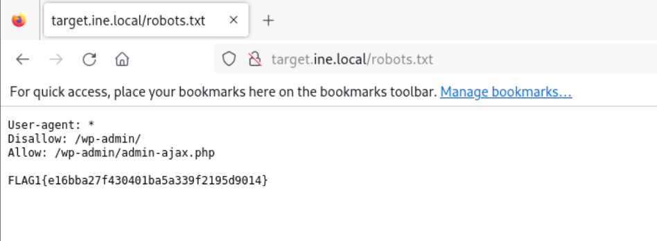
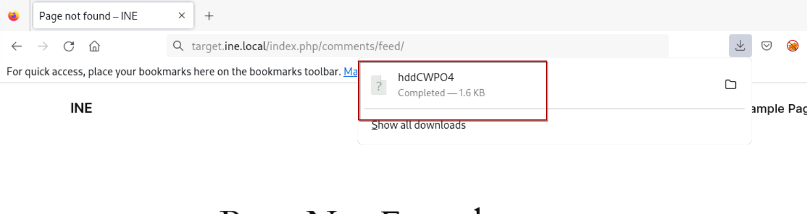
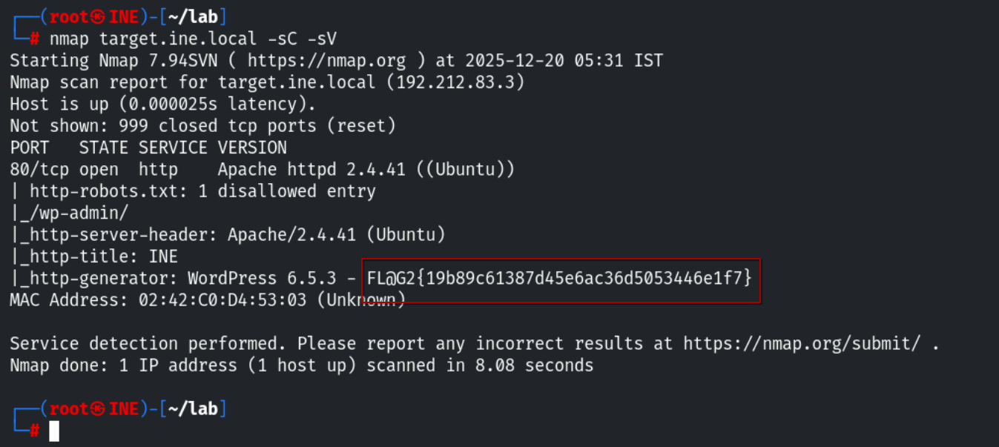
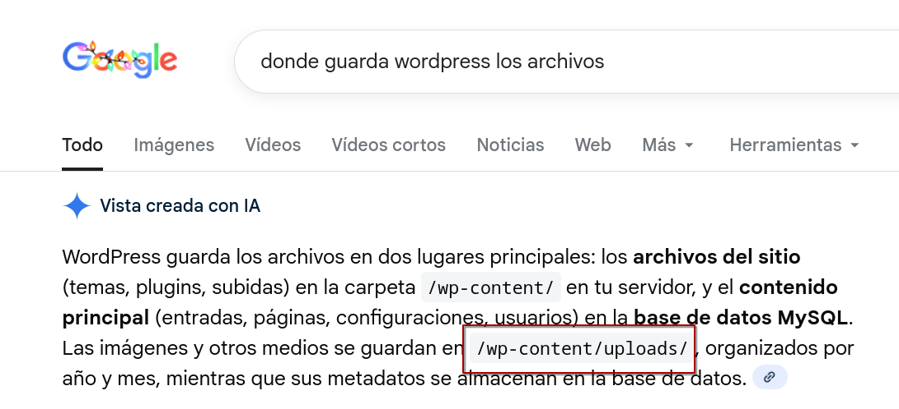
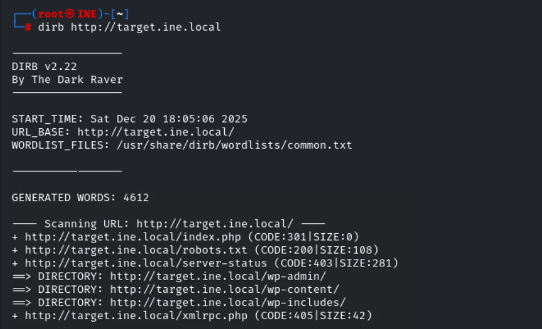
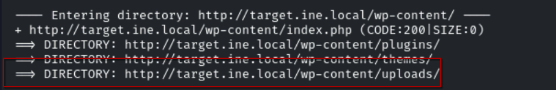
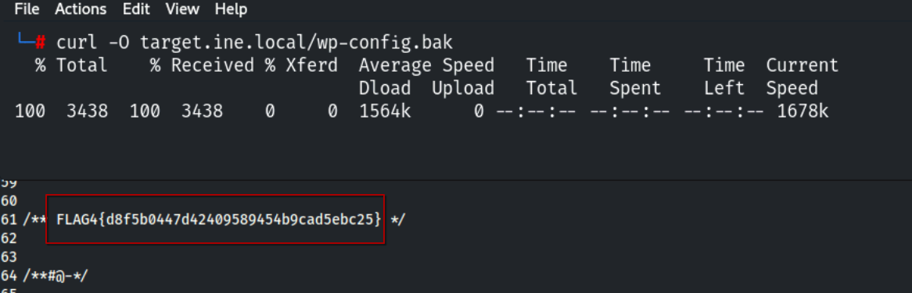
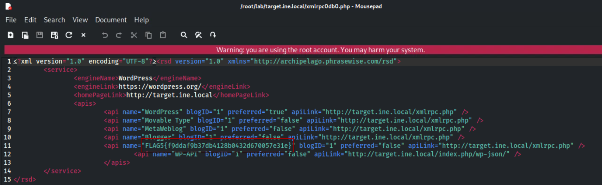

# Assessment Methodologies: Information Gathering CTF 1

Este primer laboratorio del curso de preparación para la certificación eJPT de INE se centra en técnicas de information gathering y reconocimiento aplicadas sobre una web objetivo. Se tienen que explorar algunas de las distintas técnicas vistas en la primera sección del curso en busca de potenciales vulnerabilidades, información sensible y errores de configuración.

Las herramientas que se nos indican como necesarias son: Firefox, curl y HTTrack. Teniendo esto en cuenta, podemos entender que este laboratorio está preparado de forma que lo podamos resolver usando solo técnicas pasivas. Igualmente, algunas de las flags se pueden resolver usando técnicas activas, así que también se explicarán en su correspondiente sección.

## Flag 1: This tells search engines what to and what not to avoid.

Para esta primera prueba simplemente necesitamos hacer una comprobación de los archivos que se comentan durante el inicio del curso. En el archivo robots.txt, que se usa para decirle a los buscadores que contenido no deben indexar, encontramos la primera flag.

## Flag 2: What website is running on the target, and what is its version?

Esta flag tenemos varias formas de resolverla, tanto de forma activa como de forma pasiva.

### De forma pasiva

Para poder resolver esta flag de forma pasiva necesitamos descargar el contenido de la web con HTTrack. Recordemos que no tiene por qué descargarse todo el contenido, pero el que se descarga es suficiente para resolver este reto.

Una vez descargado solo hay que navegar por los directorios y analizar el código de algunos de los archivos. Podemos encontrar la flag en varios de ellos, pero el más sencillo es: /ruta_donde_se_guarda_la_web/target.ine.local/index.html. Por su ubicación es bastante probable que sea uno de los que comprobemos.

También podemos resolver este reto comprobando los directorios de las URL que aparecen dentro de este mismo archivo. En una de ellas se nos va a descargar un fichero.

Al comprobar su contenido también encontramos dentro la flag.

### De forma activa

Otra forma de encontrar esta flag es usando nmap para obtener las versiones de servidores que hay en cada puerto abierto con la opción *-sV* y un escaneo con scripts con *-sC* para obtener información adicional sobre los puertos.

## Flag 3: Directory browsing might reveal where files are stored.

En este caso INE espera que demostremos cierto conocimiento sobre wordpress, o al menos capacidad para buscar información, si queremos resolverlo de forma pasiva. Con una simple búsqueda en google podemos encontrar la información que nos da la pista.

Si comprobamos esta ruta en el laboratorio encontramos lo que estamos buscando.

Para resolverla de forma activa podemos usar una de las distintas herramientas de enumeración de directorios. En este caso voy a usar *dirb* usando el diccionario que tiene configurado por defecto. Este método es necesario si no tenemos conocimiento obtenido de forma pasiva de la estructura de la web.

Para encontrar la flag tenemos que buscar manualmente en la lista de directorios que nos devuelve dirb.

## Flag 4: An overlooked backup file in the webroot can be problematic if it reveals sensitive configuration details.

Es posible resolver esta flag de forma similar a la anterior, pero un poco más compleja ya que no aparece directamente la información que necesitamos en un buscador. En este caso podemos buscar cual es el archivo de configuración por defecto para wordpress, encontrando que es *wp-config.php*. Teniendo esto en cuenta y que el archivo que buscamos se encuentra en el directorio raíz, podemos hacer pruebas con distintas extensiones típicas para copias de seguridad: bak, tar.gz, zip, sql, gzip, etc. En este caso la extensión es bak.

De la misma forma que la flag anterior, para resolverla de forma activa podemos usar *dirb*, esta vez indicando que queremos buscar extensiones en lugar de directorios.

## Flag 5: Certain files may reveal something interesting when mirrored.

Al descargar la web con HTTrack es posible descargar ciertos archivos que no son accesibles mediante el navegador, como pueden ser archivos zip, bak, php, js o similares. Al igual que la segunda flag, esta es muy accesible por lo que la encontramos en uno de los primeros archivos de este tipo que aparecen al explorar los directorios.

