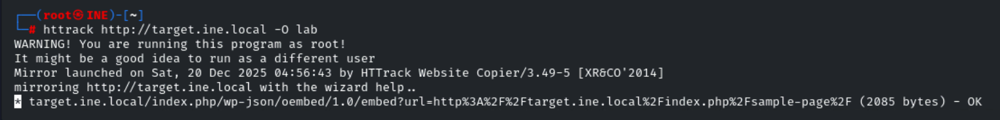
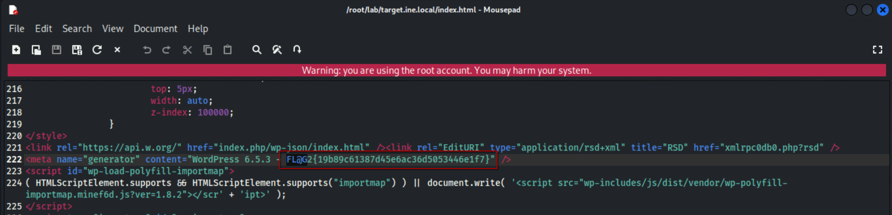
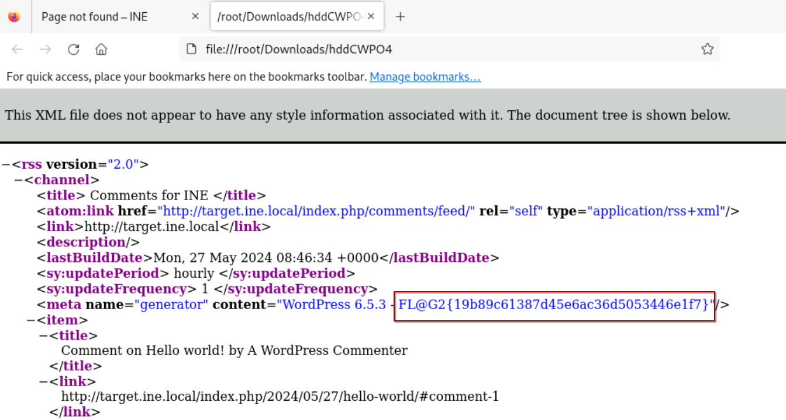
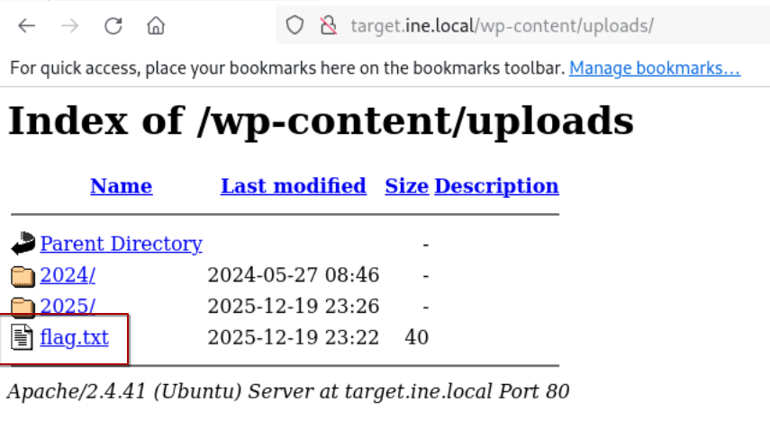
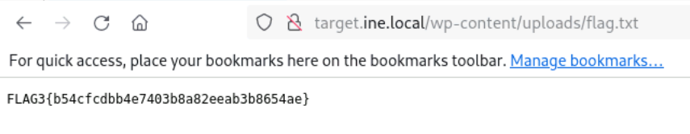
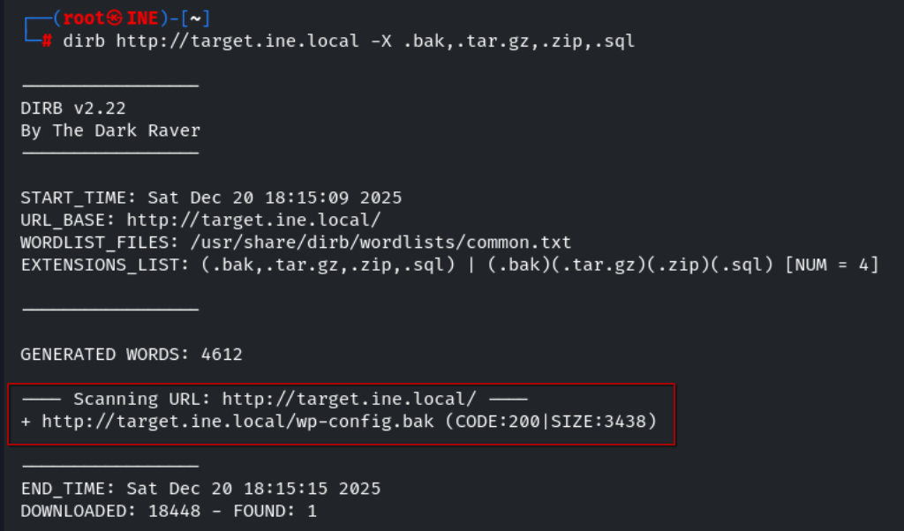

<p style="font-size:50px; font-weight: bold;margin-bottom: 0px;">Informe de Evaluación de Seguridad</p>
<p style="font-size:40px;">Information Gathering CTF 1 – eJPT Lab</p>

---

# 1. Resumen

Este primer laboratorio del curso de preparación para la certificación eJPT de INE se centra en técnicas de information gathering y reconocimiento aplicadas sobre una web objetivo. Se tienen que explorar algunas de las distintas técnicas vistas en la primera sección del curso en busca de potenciales vulnerabilidades, información sensible y errores de configuración.

Las herramientas que se nos indican como necesarias son: Firefox, curl y HTTrack. Teniendo esto en cuenta, podemos entender que este laboratorio está preparado de forma que lo podamos resolver usando solo técnicas pasivas. Igualmente, algunas de las flags se pueden resolver usando técnicas activas, así que también se explicarán en su correspondiente sección.

## Resultados generales

- Flags obtenidas: 5/5
- Tipo de hallazgos: Information Disclosure / Misconfiguration
- Dificultad: **Baja**

# 2. Alcance y Metodología

## Alcance

- Objetivo: `target.ine.local`
- Tipo de evaluación: Black-box
- Sin credenciales proporcionadas
- Entorno de laboratorio controlado

## Metodología aplicada

El análisis se realizó combinando técnicas de:

- Reconocimiento pasivo (OSINT, mirroring de sitio web)
- Enumeración activa (escaneo de red y directorios)
- Análisis manual de código fuente y estructura web

## Herramientas utilizadas

- Firefox
- curl
- HTTrack
- nmap
- dirb

# 3. Hallazgos

## Flag 1 – Exposición de archivo robots.txt

El archivo `robots.txt` es accesible públicamente y contiene información sobre rutas que no deben ser indexadas por motores de búsqueda.

### Impacto
Aunque no es una vulnerabilidad directa, puede facilitar:
- Enumeración de endpoints ocultos
- Reducción del tiempo de reconocimiento para un atacante

### Recomendación
- Evitar incluir rutas sensibles en `robots.txt`
- Asumir acceso público a este archivo

### Resolución

Para esta primera prueba simplemente necesitamos hacer una comprobación de los archivos que se comentan durante el inicio del curso. En el archivo robots.txt, que se usa para decirle a los buscadores que contenido no deben indexar, encontramos la primera flag.


## Flag 2 – Fingerprinting de tecnología y versión del servidor

El objetivo expone información sobre la tecnología utilizada, permitiendo identificar el stack y posibles versiones vulnerables.

### Impacto
La exposición de versiones puede permitir:
- Identificación de vulnerabilidades conocidas (CVE)
- Ataques dirigidos a versiones específicas
- Reducción del esfuerzo de explotación

### Recomendación
- Ocultar cabeceras de versión del servidor
- Eliminar referencias a versiones en frontend
- Endurecer configuración del servidor web

### Resolución pasiva

Para poder resolver esta flag de forma pasiva necesitamos descargar el contenido de la web con HTTrack. Recordemos que no tiene por qué descargarse todo el contenido, pero el que se descarga es suficiente para resolver este reto.

```bash
httrack target.ine.local -O lab
```



Una vez descargado solo hay que navegar por los directorios y analizar el código de algunos de los archivos. Podemos encontrar la flag en varios de ellos, pero el más sencillo es: lab/target.ine.local/index.html. Por su ubicación es bastante probable que sea uno de los que comprobemos.



También podemos resolver este reto comprobando los directorios de las URL que aparecen dentro de este mismo archivo. En una de ellas se nos va a descargar un fichero.


Al comprobar su contenido también encontramos dentro la flag.



### Resolución activa

Otra forma de encontrar esta flag es usando nmap para obtener las versiones de servidores que hay en cada puerto abierto con la opción *-sV* y un escaneo con scripts con *-sC* para obtener información adicional sobre los puertos.

```bash
nmap -p80 -sC -sV target.ine.local
```


## Flag 3 – Enumeración de directorios

Se detecta la exposición de estructura de directorios accesibles públicamente, incluyendo el directorio `/uploads`.

### Impacto
- Exposición de archivos subidos
- Posible fuga de información sensible
- Riesgo de carga y ejecución de archivos maliciosos

### Recomendación
- Deshabilitar listado de directorios
- Restringir acceso a directorios de subida
- Implementar control de acceso adecuado

### Resolución pasiva

En este caso INE espera que demostremos cierto conocimiento sobre wordpress, o al menos capacidad para buscar información, si queremos resolverlo de forma pasiva. Con una simple búsqueda en google podemos encontrar la información que nos da la pista.


Si comprobamos esta ruta en el laboratorio encontramos lo que estamos buscando.





### Resolución activa

Para resolverla de forma activa podemos usar una de las distintas herramientas de enumeración de directorios. En este caso voy a usar *dirb* usando el diccionario que tiene configurado por defecto.

```bash
dirb target.ine.local
```


Para encontrar la flag tenemos que buscar manualmente en la lista de directorios que nos devuelve dirb.


## Flag 4 – Archivo de copia de seguridad expuesto en el webroot

Se identifica la presencia de un archivo de backup en el directorio público del servidor web.

- Archivo detectado: `wp-config.php.bak`
- Descubierto mediante enumeración de extensiones comunes

### Impacto

Este hallazgo es crítico en entornos reales, ya que puede contener:
- Credenciales de base de datos
- Claves de autenticación
- Configuración interna del sistema

### Recomendación

- Eliminar archivos de backup del entorno público
- Almacenar backups fuera del webroot
- Bloquear extensiones sensibles en el servidor

### Resolución

Para resolverla podemos usar *dirb*, esta vez indicando que queremos buscar extensiones en lugar de directorios.

```bash
dirb target.ine.local -X .bak,.tar.gz,.zip,.sql
```



## Flag 5 – Exposición de archivos mediante mirroring del sitio

El análisis mediante mirroring del sitio web permitió descubrir archivos no accesibles directamente desde el navegador.

### Impacto

- Exposición de recursos internos
- Posible fuga de información no vinculada públicamente
- Incremento de la superficie de ataque

### Recomendación

- Revisar todos los archivos desplegados en producción
- Eliminar recursos no referenciados públicamente
- Restringir acceso a archivos no necesarios

### Resolución

Al descargar la web con HTTrack es posible descargar ciertos archivos que no son accesibles mediante el navegador, como pueden ser archivos zip, bak, php, js o similares. Al igual que la segunda flag, esta es muy accesible por lo que la encontramos en uno de los primeros archivos de este tipo que aparecen al explorar los directorios.


# 4. Conclusiones

- El reconocimiento pasivo puede revelar gran parte de la superficie de ataque sin interacción directa
- Las malas configuraciones son una fuente común de exposición de información
- La enumeración de directorios sigue siendo una técnica altamente efectiva
- Los archivos de backup representan un riesgo crítico en entornos productivos
