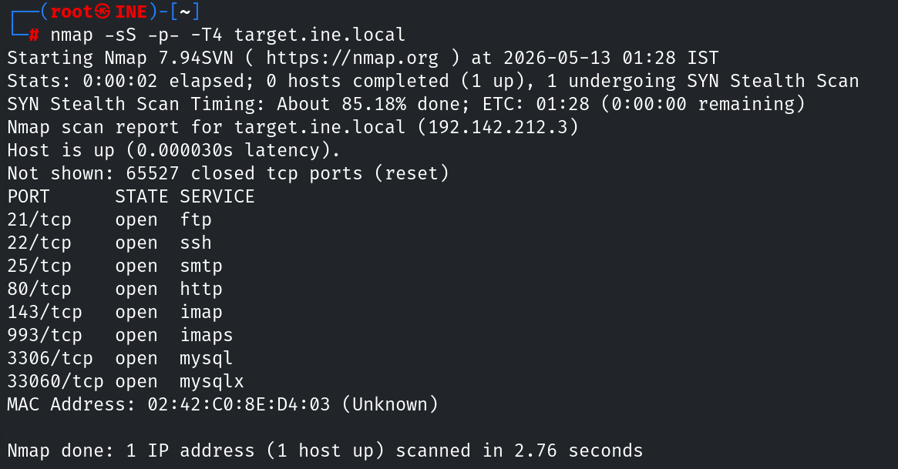
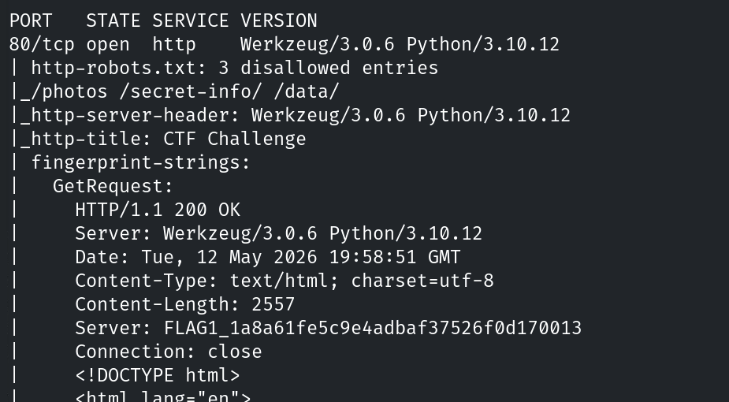
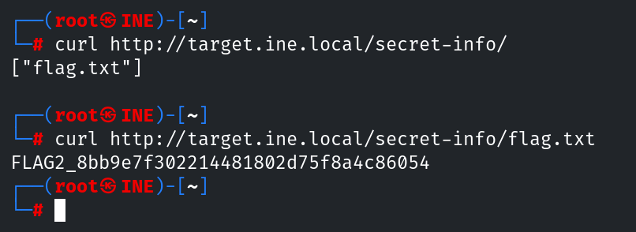

# Informe de Evaluación de Seguridad
#### Footprinting and scanning CTF 1 – eJPT Lab

---

## 1. Resumen

El reconocimiento implica recopilar datos de forma activa o pasiva, como encabezados del servidor, puertos abiertos, directorios expuestos y configuraciones del sistema. Técnicas como el escaneo, la consulta de registros DNS, el examen de archivos de aplicaciones web (por ejemplo, robots.txt) y el análisis de encabezados de respuesta ayudan a descubrir información crítica que puede ser útil en fases posteriores de explotación. Un reconocimiento efectivo permite a los evaluadores mapear la superficie de ataque, priorizar objetivos y planificar su enfoque con una detección mínima por parte de las defensas del sistema.

### Resultados generales

- Flags obtenidas: 4/4
- Tipo de hallazgos: Divulgación de información - Errores de configuración
- Dificultad: **Baja**

## 2. Alcance y Metodología

### Alcance

- Objetivo: `target.ine.local`
- Tipo de evaluación: Black-box
- Sin credenciales proporcionadas
- Entorno de laboratorio controlado

### Metodología aplicada

El análisis se realizó combinando técnicas de enumeración activa:

- Escaneo de puertos
- Enumeración de servicios

### Flags

- **Flag 1:** El servidor anuncia con orgullo su identidad en cada respuesta. Mira con atención; podrías encontrar algo inusual.
- **Flag 2:** Las instrucciones del guardián suelen revelar lo que debería permanecer oculto. No olvides leer entre líneas.
- **Flag 3:** El acceso anónimo a veces conduce a tesoros olvidados. Conéctate y explora el directorio; podrías encontrar algo valioso.
- **Flag 4:** Una base de datos con un nombre apropiado puede ser bastante reveladora. Revisa las configuraciones para descubrir el tesoro oculto.

### Herramientas utilizadas

- Nmap
- FTP
- MySQL

## 3. Hallazgos

### Flag 1 - Divulgación de información sobre el servidor

El servidor web filtra información sensible sobre su estado y configuración como métodos soportados, versión del servidor o lenguajes de programación.

#### Impacto

Aunque no es una vulnerabilidad directa, puede facilitar el análisis de vulnerabilidades al mostrar información como los métodos o la versión del lenguaje.

#### Recomendación
- No exponer información del servidor ni versiones en cabeceras HTTP como Server
- Usar un reverse proxy (por ejemplo Nginx) para ocultar el backend real
- Desactivar el modo debug en producción en frameworks como Flask/Werkzeug

#### Resolución

El primer paso es identificar los puertos abiertos en el objetivo. Para ello lanzamos un escaneo con nmap:

```bash
nmap -sS -p- -T4 target.ine.local
```



El siguiente paso natural es enumerar servicios y versiones de forma general, antes de pasar a una enumeración más específica. En este paso ya podemos encontrar bastante información relevante:

```bash
nmap -sC -sV -p21,22,25,80,143,993,3306,33060 -T4 target.ine.local
```



### Flag 2 -  – Exposición de archivo robots.txt

El archivo `robots.txt` es accesible públicamente y contiene información sobre rutas que no deben ser indexadas por motores de búsqueda.

#### Impacto
Aunque no es una vulnerabilidad directa, puede facilitar:
- Enumeración de endpoints ocultos
- Reducción del tiempo de reconocimiento para un atacante

#### Recomendación
- Evitar incluir rutas sensibles en `robots.txt`
- Asumir acceso público a este archivo

#### Resolución

En la última captura de la flag anterior podemos ver como el archivo `robots.txt` revela tres directorios: `/photos`, `/secret-info` y `/data`. El segundo parece bastante sospechoso por lo que comprobamos si podemos acceder:

```bash
curl http://target.ine.local/secret-info/
```



## 4. Conclusiones

Comentar lo aprendido

- 
