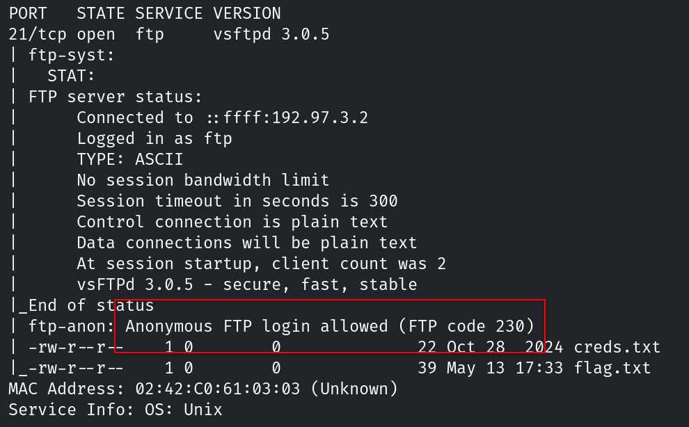
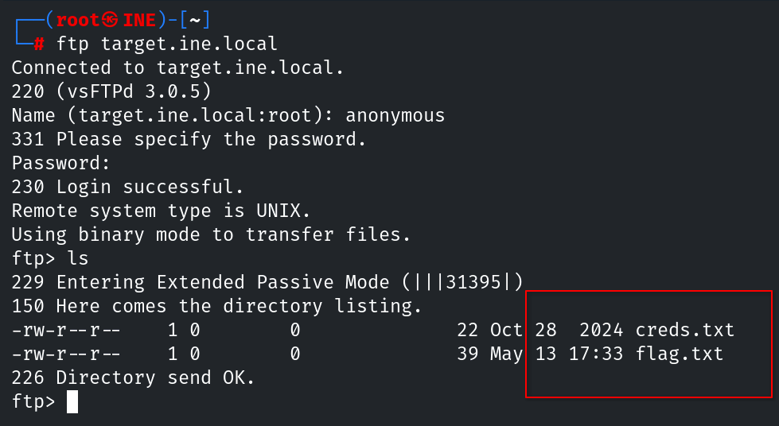
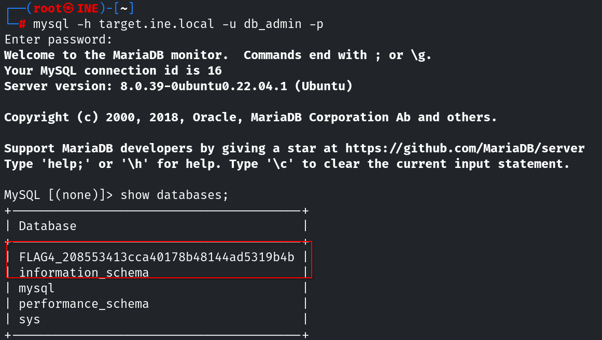

# Informe de Evaluación de Seguridad
#### Footprinting and scanning CTF 1 – eJPT Lab

---

## 1. Resumen

El reconocimiento implica recopilar datos de forma activa o pasiva, como encabezados del servidor, puertos abiertos, directorios expuestos y configuraciones del sistema. Técnicas como el escaneo, la consulta de registros DNS, el examen de archivos de aplicaciones web (por ejemplo, robots.txt) y el análisis de encabezados de respuesta ayudan a descubrir información crítica que puede ser útil en fases posteriores de explotación. Un reconocimiento efectivo permite a los evaluadores mapear la superficie de ataque, priorizar objetivos y planificar su enfoque con una detección mínima por parte de las defensas del sistema.

### Resultados generales

- Flags obtenidas: 4/4
- Tipo de hallazgos: Divulgación de información - Errores de configuración
- Dificultad: **Baja**

## 2. Alcance y Metodología

### Alcance

- Objetivo: `target.ine.local`
- Tipo de evaluación: Black-box
- Sin credenciales proporcionadas
- Entorno de laboratorio controlado

### Metodología aplicada

El análisis se realizó combinando técnicas de enumeración activa:

- Escaneo de puertos
- Enumeración de servicios

### Flags

- **Flag 1:** El servidor anuncia con orgullo su identidad en cada respuesta. Mira con atención; podrías encontrar algo inusual.
- **Flag 2:** Las instrucciones del guardián suelen revelar lo que debería permanecer oculto. No olvides leer entre líneas.
- **Flag 3:** El acceso anónimo a veces conduce a tesoros olvidados. Conéctate y explora el directorio; podrías encontrar algo valioso.
- **Flag 4:** Una base de datos con un nombre apropiado puede ser bastante reveladora. Revisa las configuraciones para descubrir el tesoro oculto.

### Herramientas utilizadas

- Nmap
- FTP
- MySQL

## 3. Hallazgos

### Flag 1 - Divulgación de información sobre el servidor

El servidor web filtra información sensible sobre su estado y configuración como métodos soportados, versión del servidor o lenguajes de programación.

#### Impacto

Aunque no es una vulnerabilidad directa, puede facilitar el análisis de vulnerabilidades al mostrar información como los métodos o la versión del lenguaje.

#### Recomendación
- No exponer información del servidor ni versiones en cabeceras HTTP como Server
- Usar un reverse proxy (por ejemplo Nginx) para ocultar el backend real
- Desactivar el modo debug en producción en frameworks como Flask/Werkzeug

#### Resolución

El primer paso es identificar los puertos abiertos en el objetivo. Para ello lanzamos un escaneo con nmap:

```bash
nmap -sS -p- -T4 target.ine.local
```


El siguiente paso natural es enumerar servicios y versiones de forma general, antes de pasar a una enumeración más específica. En este paso ya podemos encontrar bastante información relevante:

```bash
nmap -sC -sV -p21,22,25,80,143,993,3306,33060 -T4 target.ine.local
```


### Flag 2 -  – Exposición de archivo robots.txt

El archivo `robots.txt` es accesible públicamente y contiene información sobre rutas que no deben ser indexadas por motores de búsqueda.

#### Impacto
Aunque no es una vulnerabilidad directa, puede facilitar:
- Enumeración de endpoints ocultos
- Reducción del tiempo de reconocimiento para un atacante

#### Recomendación
- Evitar incluir rutas sensibles en `robots.txt`
- Asumir acceso público a este archivo

#### Resolución

En la última captura de la flag anterior podemos ver como el archivo `robots.txt` revela tres directorios: `/photos`, `/secret-info` y `/data`. El segundo parece bastante sospechoso por lo que comprobamos si podemos acceder:

```bash
curl http://target.ine.local/secret-info/
```


### Flag 3 - Usuario anonymous en FTP

El servicio FTP está mal configurado, permitiendo el acceso anónimo y filtrando así la flag de este reto además de las credenciales de la base de datos.

#### Impacto

Permitir conexión anónima en un servidor FTP implica que cualquier usuario puede acceder sin autenticarse con credenciales reales. Esto supone varios riesgos de seguridad:

- Acceso no autorizado a archivos públicos o mal configurados.
- Posible fuga de información sensible.
- Uso del servidor para distribuir malware o contenido ilegal.
- Mayor exposición a ataques automatizados y enumeración de directorios.
- Dificultad para auditar quién realizó acciones concretas.

#### Recomendación
Se recomienda deshabilitar el acceso anónimo salvo que sea estrictamente necesario y limitar siempre los permisos de lectura/escritura.

#### Resolución

En el escaneo realizado inicialmente con nmap podemos ver que en la sección correspondiente al servidor FTP se indica que el acceso anonimo al servidor se encuentra habilitado.



Una vez conectados al servidor, encontramos la flag de este reto y las credenciales de la base de datos.



### Flag 4 - Enumeración de bases de datos mediante credenciales expuestas

Durante la resolución del reto anterior se localizan unas credenciales almacenadas en texto plano. Por el contexto y el nombre de usuario, se deduce que pertenecen al servicio de base de datos. Con ellas ha sido posible conectarse remotamente al servidor de bases de datos y enumerar su contenido. La flag se encuentra expuesta en el nombre de una de las bases de datos listadas.

#### Impacto

Aunque no implica directamente la extracción de datos sensibles, este tipo de exposición puede facilitar:

- Acceso no autorizado.
- Enumeración de bases de datos, tablas y usuarios.
- Obtención de información sensible sobre la infraestructura.
- Identificación de aplicaciones, entornos o backups.

Además, almacenar credenciales en texto plano incrementa significativamente el riesgo de compromiso total del sistema si un atacante obtiene acceso inicial.

#### Recomendación
- No almacenar credenciales en texto plano.
- Limitar el acceso remoto al servicio MySQL.
- Restringir permisos innecesarios.
- Monitorizar accesos remotos.

#### Resolución

Se ha realizado una conexión a la base de datos con las credenciales obtenidas en el reto anterior y se han mostrado las bases de datos disponibles dentro del gestor.

```bash
mysql -h target.ine.local -u db_admin -p
```



## 4. Conclusiones

- La enumeración activa permite identificar rápidamente servicios expuestos y posibles vectores de ataque.
- La divulgación de información mediante banners, cabeceras o configuraciones por defecto facilita el reconocimiento de la infraestructura objetivo.
- Servicios mal configurados pueden derivar en la exposición de credenciales y recursos internos.
- La exposición de servicios de bases de datos accesibles remotamente amplía la superficie de ataque y facilita tareas de enumeración.
- Incluso información aparentemente poco sensible, como nombres de bases de datos o rutas ocultas, puede aportar contexto útil para un atacante durante fases posteriores.
