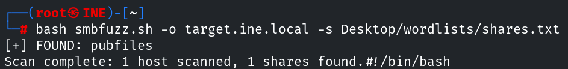
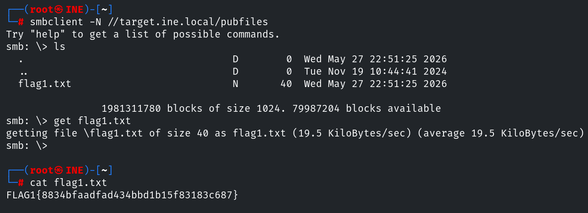

# Informe de Evaluación de Seguridad
#### Enumeration CTF 1 – eJPT Lab

---

## 1. Resumen

Tercer laboratorio del curso de preparación para la certificación eJPT de INE. Se centra en técnicas de enumeración de servidores. En este laboratorio nos vamos a encontrar con distintos servicios como: SSH, SMB o FTP.

### Resultados generales

- Flags obtenidas: 4/4
- Tipo de hallazgos:  Information disclosure / Misconfiguration / Debilidad de credenciales
- Dificultad: **Media**

## 2. Alcance y Metodología

### Alcance

- Objetivo: `IP`
- Tipo de evaluación: Black-box
- Sin credenciales proporcionadas
- Entorno de laboratorio controlado

### Metodología aplicada

El análisis se realizó combinando técnicas de:

- Enumeración de servicios
- Fuerza bruta sobre credenciales

### Flags

- **Flag 1:** Hay un recurso compartido Samba que permite acceso anónimo. ¡A ver qué hay dentro!
- **Flag 2:** Uno de los usuarios de Samba tiene una contraseña débil. Su recurso privado, que tiene el mismo nombre que su usuario, está en riesgo.
- **Flag 3:** Sigue la pista proporcionada en la flag anterior para descubrir esta.
- **Flag 4:** Este es un aviso destinado a disuadir a usuarios no autorizados de iniciar sesión.

### Herramientas utilizadas

- Nmap
- Metasploit
- Hydra
- enum4linux
- smbclient
- smbmap

## 3. Hallazgos

### Flag 1 - Explosición de recursos compartidos SMB
En esta prueba se ha identificado un recurso compartido SMB accesible mediante autenticación anónima, permitiendo listar y descargar archivos sin necesidad de credenciales válidas.

#### Impacto
La exposición de recursos compartidos accesibles por usuarios anónimos puede provocar fuga de información sensible, acceso no autorizado a documentos internos o facilitar ataques posteriores mediante recolección de credenciales, nombres de usuario o configuraciones internas..

#### Recomendación
- Deshabilitar el acceso anónimo (guest access) en Samba.
- Restringir permisos únicamente a usuarios autorizados.
- Aplicar el principio de mínimo privilegio sobre los recursos compartidos.
- Auditar periódicamente los shares publicados.
- Monitorizar accesos SMB sospechosos.

#### Resolución

El primer paso es realizar un escaneo de puertos para comprobar los servicios activos, seguido de una enumeración de servicios y versiones con `nmap`:

```bash
nmap -sS -p- -T4 target.ine.local
nmap -p22,139,445,5554 -T4 -sC -sV target.ine.local
```

Encontramos varios servicios disponibles, pero para esta primera flag nos centramos en SMB.


Para encontrar distintos recursos que permitan acceso anónimo, podemos usar `smbclient` o `smbmap` dentro de un bucle que recorra una lista de recursos. Para ello se nos proporciona una wordlist en `/root/Desktop/wordlists/shares.txt`. En este laboratorio se ha usado el script `smbfuzz`, disponible [aquí](https://github.com/mjmariscalr/scripts/tree/main/smbfuzz), que enumera usando `smbclient`.



Una vez encontrados los recursos accesibles, nos conectamos usando `smbclient`:

```bash
smbclient -N //target.ine.local/NOMBREDELRECURSO
```

Dentro encontramos la primera flag.



## 4. Conclusiones

Comentar lo aprendido

- 
