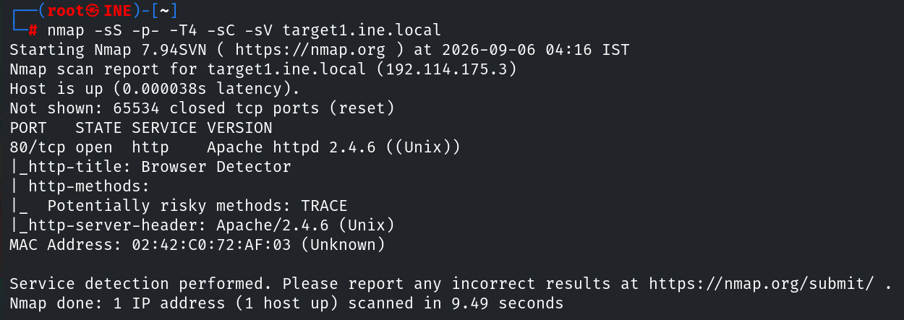
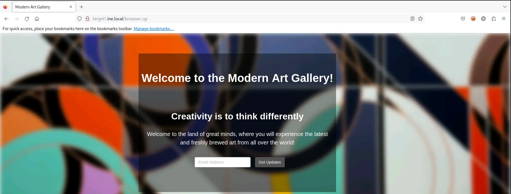
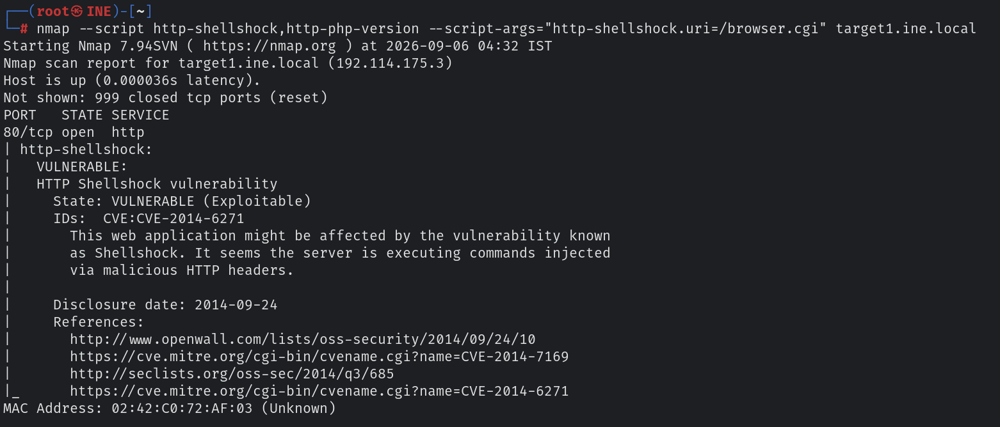
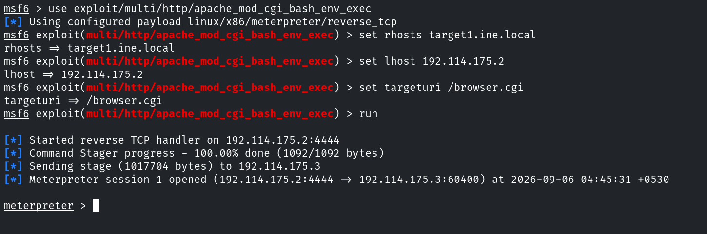
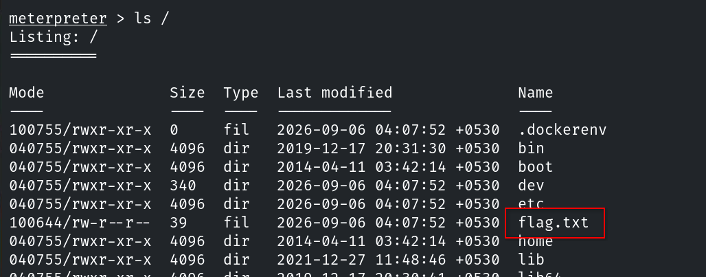

# Informe de Evaluación de Seguridad
#### Host & Network Penetration Testing: System-Host Based Attacks CTF 2

## Flag 1 - Check the root ('/') directory for a file that might hold the key to the first flag on target1.ine.local.

Para obtener esta flag, primero debemos conseguir acceso al objetivo. El primer paso es enumerar los posibles vectores de ataque.

```console
root@ine# nmap -sS -p- -T4 -sC -sV target1.ine.local
```



Si accedemos desde el navegador, nos encontramos con un script cgi.



Sabemos que este tipo de script puede estar asociado a dos vulnerabilidades estudiadas en el curso: PHP CGI Argument Injection y Shellshock. Con una sola comprobación podemos obtener la versión de php para comprobar si existe la posibilidad de la primera, y saber si es vulnerable a la segunda.

```console
root@ine# nmap --script http-shellshock,http-php-version --script-args "http-shellshock.uri=/ruta/scirpt.cgi" target1.ine.local
```

Puesto que nmap nos confirma la vulnerabilidad a shellshock, podemos pasar directamente a explotarla.




Por último, buscamos la flag en `/`.


