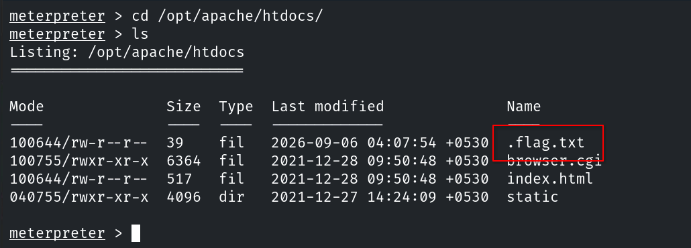
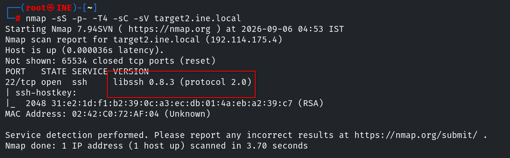
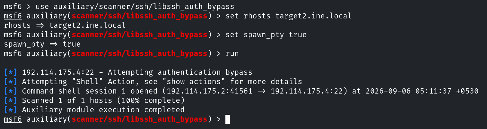
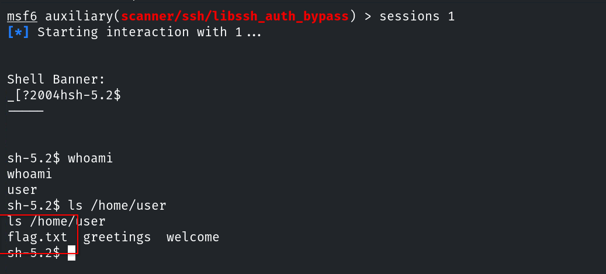
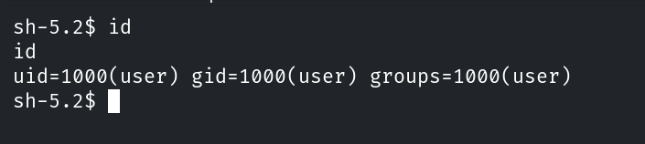

# Informe de Evaluación de Seguridad
#### Host & Network Penetration Testing: System-Host Based Attacks CTF 2

## Flag 1 - Check the root ('/') directory for a file that might hold the key to the first flag on target1.ine.local.

Para obtener esta flag, primero debemos conseguir acceso al objetivo. El primer paso es enumerar los posibles vectores de ataque.

```console
root@ine# nmap -sS -p- -T4 -sC -sV target1.ine.local
```


Si accedemos desde el navegador, nos encontramos con un script cgi.


Sabemos que este tipo de script puede estar asociado a dos vulnerabilidades estudiadas en el curso: [PHP CGI Argument Injection](https://github.com/mjmariscalr/ejpt/blob/main/04_explotacion/linux/php.md) y [Shellshock](https://github.com/mjmariscalr/ejpt/blob/main/04_explotacion/linux/shellshock.md). Con una sola comprobación podemos obtener la versión de php para comprobar si existe la posibilidad de la primera, y saber si es vulnerable a la segunda.

```console
root@ine# nmap --script http-shellshock,http-php-version --script-args "http-shellshock.uri=/ruta/scirpt.cgi" target1.ine.local
```

Puesto que nmap nos confirma la vulnerabilidad a shellshock, podemos pasar directamente a explotarla.


Por último, buscamos la flag en `/`.


## Flag 2 - In the server's root directory, there might be something hidden. Explore '/opt/apache/htdocs/' carefully to find the next flag on target1.ine.local.

Para esta segunda flag, basta con buscar en el directorio que nos indica la pista para encontrarla



## Flag 3 -  Investigate the user's home directory and consider using 'libssh_auth_bypass' to uncover the flag on target2.ine.local.

Ya que cambiamos de objetivo, necesitamos volver a escanear los posibles puertos abiertos.

```console
root@ine# nmap -sS -p- -T4 -sC -sV target2.ine.local
```



Sabemos que las versiones de `libssh` anteriores a la `0.8.4` son vulnerables a [CVE-2018-10933](https://github.com/mjmariscalr/ejpt/blob/main/04_explotacion/linux/libsshAuthBypass.md), así que usamos metasploit para conseguir acceso al sistema.



Terminamos comprobando el directorio `/home` del usuario para obtener la flag.



## Flag 4 - The most restricted areas often hold the most valuable secrets. Look into the '/root' directory to find the hidden flag on target2.ine.local.

Para esta última flag, necesitamos un usuario con privilegios en el sistema. El primer paso es comprobar si el usuario explotado tiene acceso privilegiado.


