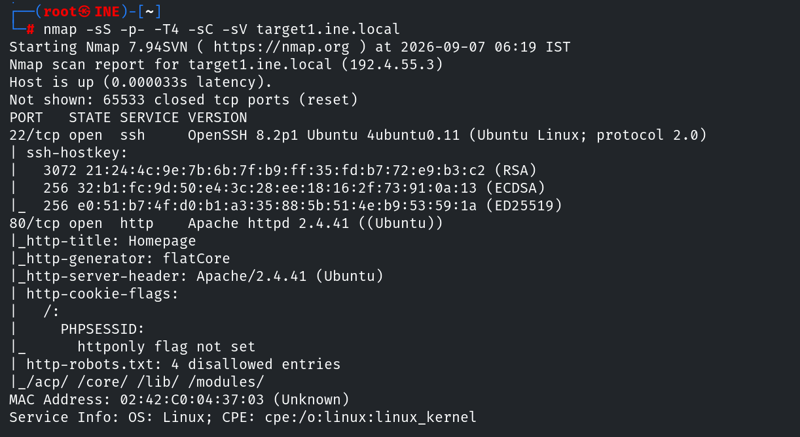
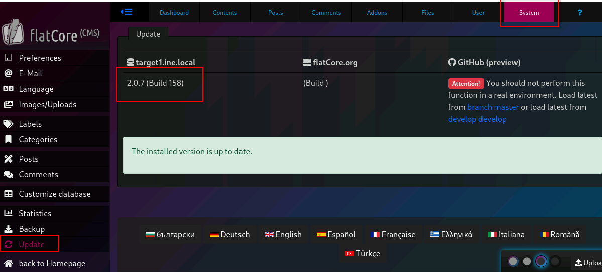
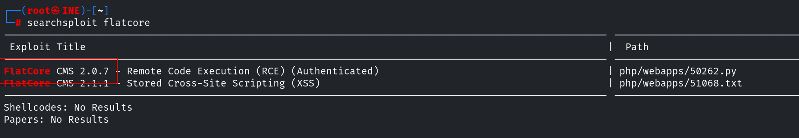
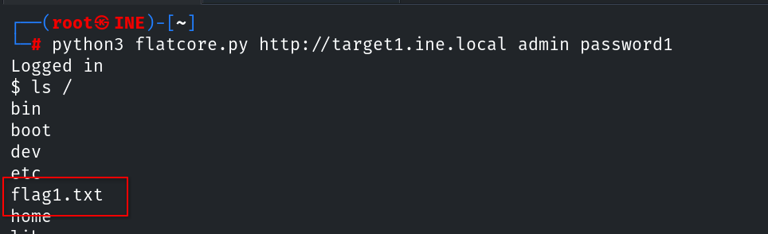
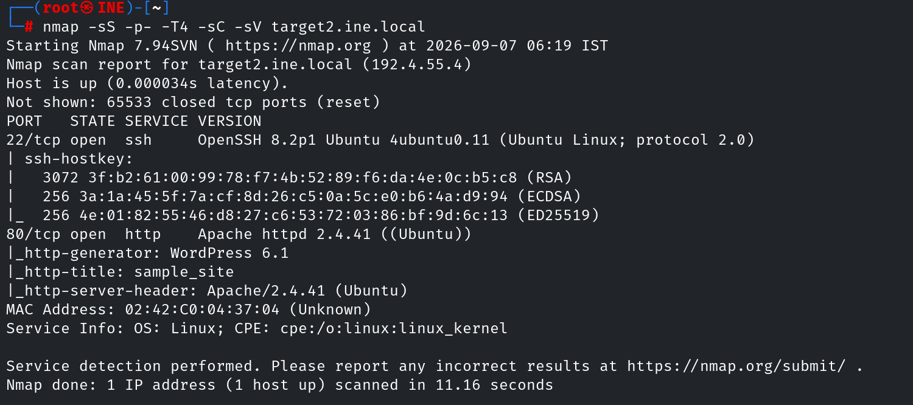

# Host & Network Penetration Testing: Exploitation CTF 1


## Flag 1 - Identify and exploit the vulnerable web application running on target1.ine.local and retrieve the flag from the root directory. The credentials admin:password1 may be useful.

Para obtener esta flag, primero debemos conseguir acceso al objetivo. El primer paso es enumerar los posibles vectores de ataque.

```console
root@ine# nmap -sS -p- -T4 -sC -sV target1.ine.local
```



Comprobamos que el sistema está ejecutando un CMS flatcore. Usamos las credenciales proporcionadas en la pista para iniciar sesión en el panel de administración y comprobar la versión instalada. Para ello vamos a `System -> Update`.



Esta versión es vulnerable a [ejecución de código remoto]() y tiene un exploit disponible en searchsploit.



Lo ejecutamos con `python3 flatcore.py http://target1.ine.local admin password1` y obtenemos acceso al sistema. Este exploit no obtiene una shell al sistema, sino que la simula mediante un bucle que envía comandos y muestra la respuesta. Para terminar, localizamos la flag en `/`.



## Flag 2 - Further, identify and compromise an insecure system user on target1.ine.local.


## Flag 3 - Identify and exploit the vulnerable plugin used by the web application running on target2.ine.local and retrieve the flag3.txt file from the root directory.

Ya que cambiamos de objetivo, necesitamos volver a escanear los posibles puertos abiertos.

```console
root@ine# nmap -sS -p- -T4 -sC -sV target2.ine.local
```



## Flag 4 - Further, identify and compromise a system user requiring no authentication on target2.ine.local.


