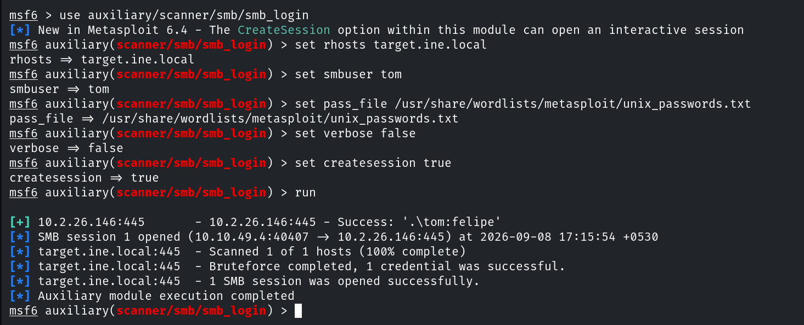
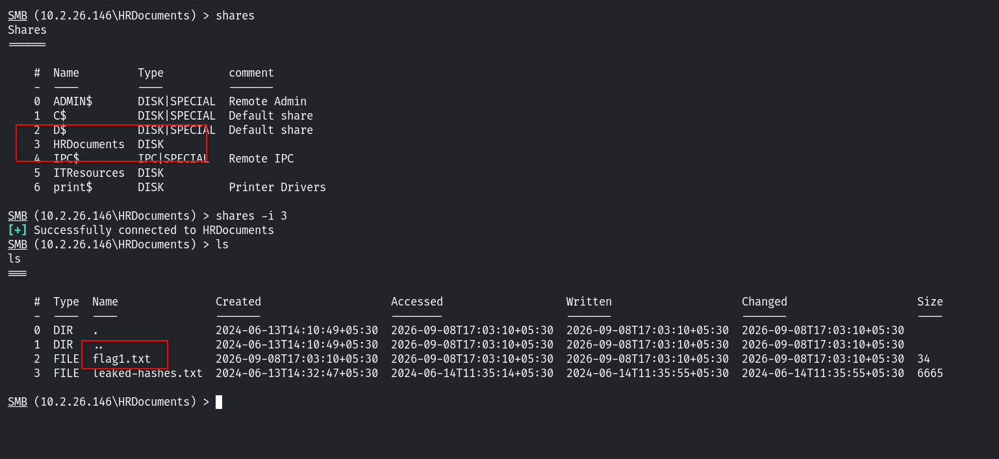

# Host & Network Penetration Testing: Exploitation CTF 2

## Flag 1: Looks like smb user tom has not changed his password from a very long time.

Para obtener esta flag, primero debemos conseguir acceso al objetivo. El primer paso es enumerar los posibles vectores de ataque.

```console
root@ine# nmap -sS -p- -T4 -sC -sV target.ine.local
Nmap scan report for target.ine.local (10.2.26.146)
Host is up (0.0037s latency).
Not shown: 65523 closed tcp ports (reset)
PORT      STATE SERVICE            VERSION
21/tcp    open  ftp                Microsoft ftpd
| ftp-syst: 
|_  SYST: Windows_NT
80/tcp    open  http               Microsoft HTTPAPI httpd 2.0 (SSDP/UPnP)
|_http-server-header: Microsoft-IIS/8.5
| http-methods: 
|_  Potentially risky methods: TRACE
|_http-title: IIS Windows Server
135/tcp   open  msrpc              Microsoft Windows RPC
139/tcp   open  netbios-ssn        Microsoft Windows netbios-ssn
445/tcp   open  microsoft-ds?
3389/tcp  open  ssl/ms-wbt-server?
| ssl-cert: Subject: commonName=WIN-M878Q9NE9S6
| Not valid before: 2026-09-07T11:32:36
|_Not valid after:  2027-03-09T11:32:36
|_ssl-date: 2026-09-08T11:39:51+00:00; 0s from scanner time.
| rdp-ntlm-info: 
|   Target_Name: WIN-M878Q9NE9S6
|   NetBIOS_Domain_Name: WIN-M878Q9NE9S6
|   NetBIOS_Computer_Name: WIN-M878Q9NE9S6
|   DNS_Domain_Name: WIN-M878Q9NE9S6
|   DNS_Computer_Name: WIN-M878Q9NE9S6
|   Product_Version: 6.3.9600
|_  System_Time: 2026-09-08T11:39:44+00:00
49152/tcp open  msrpc              Microsoft Windows RPC
49153/tcp open  msrpc              Microsoft Windows RPC
49154/tcp open  msrpc              Microsoft Windows RPC
49155/tcp open  msrpc              Microsoft Windows RPC
49167/tcp open  msrpc              Microsoft Windows RPC
49168/tcp open  msrpc              Microsoft Windows RPC
Service Info: OS: Windows; CPE: cpe:/o:microsoft:windows

Host script results:
| smb2-time: 
|   date: 2026-09-08T11:39:46
|_  start_date: 2026-09-08T11:32:28
| smb2-security-mode: 
|   3:0:2: 
|_    Message signing enabled but not required
```

Usamos el módulo `smb_login` de metasploit para intentar obtner las credenciales de tom.



Aprovechamos que hemos creado una sesión con este módulo para explorar los recursos compartidos del servidor y encontramos la flag en el recurso `HRDocuments`.



## Flag 2: Using the NTLM hash list discovered in the previous challenge, can you compromise the smb user nancy?


## Flag 3: I wonder what the hint found in the previous challenge be useful for!


## Flag 4: Can you compromise the target machine and retrieve the C://flag4.txt file?


