# Host & Network Penetration Testing: Exploitation CTF 3

## Flag 1: A vulnerable service maybe running on target1.ine.local. If exploitable, retrieve the flag from the root directory.

Para obtener esta flag, primero debemos conseguir acceso al objetivo. El primer paso es enumerar los posibles vectores de ataque.

```console
root@ine# nmap -sS -p- -T4 -sC -sV target.ine.local
```

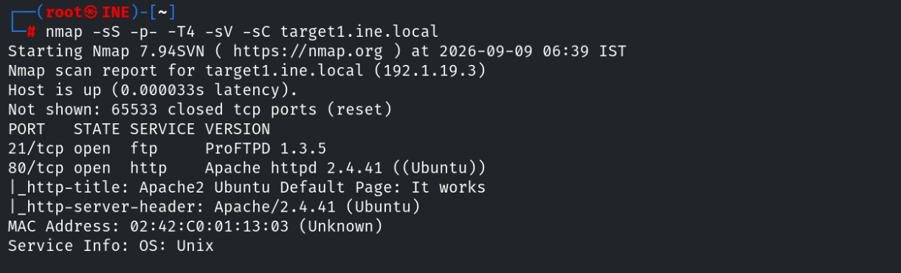

Si hacemos una busqueda del servicio **FTP** encontrado, podemos ver que hay un exploit para esta versión. [CVE-2015-3306](https://www.incibe.es/en/incibe-cert/early-warning/vulnerabilities/cve-2015-3306) es una vulnerabilidad de ProFTPD (un servidor FTP) que permite ejecución remota de código en la versión 1.3.5.

Está relacionada con el módulo mod_copy de ProFTPD. Permite abusar de determinadas operaciones de copia para manipular archivos en el servidor y, bajo las condiciones adecuadas, conseguir ejecutar código con los privilegios del proceso de ProFTPD.

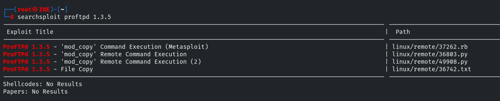

Como disponemos de un exploit en metasploit, podemos hacer uso de este para después elevar la sesión a meterpreter.

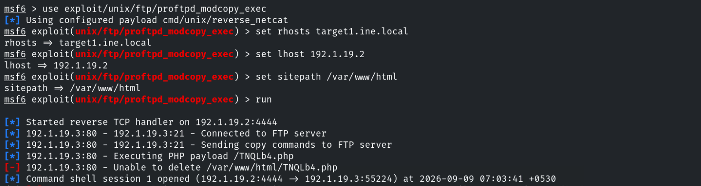

Para configurar la opción `SITEPATH`, necesitamos conocer el directorio en el que se encuentra alojada la web dentro del servidor. para ello podemos enumerar a través del navegador.

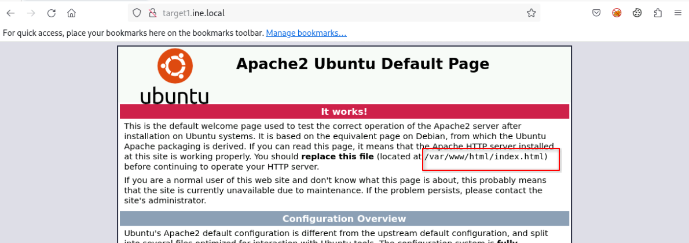

Una vez que tenemos acceso al sistema con meterpreter podemos buscar la flag en el directorio raiz.

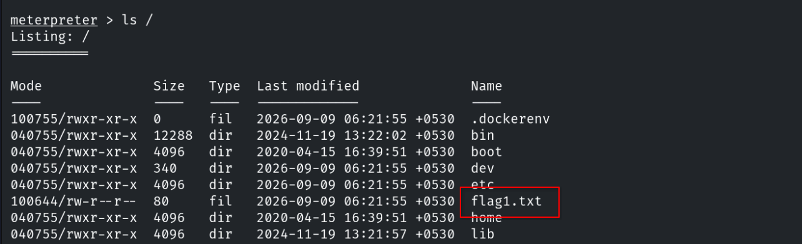

## Flag 2: Further, a quick interaction with a local network service on target1.ine.local may reveal this flag. Use the hint given in the previous flag.

Dentro del archivo `flag1.txt` aparece el texto `Remember, the magical word is 'letmein'`. Ahora mismo no nos dice nada, pero será útil más adelante.

Para enumerar los servicios a los que está conectado el objetivo podemos hacer uso de la herramienta `netstat`, disponible en meterpreter.

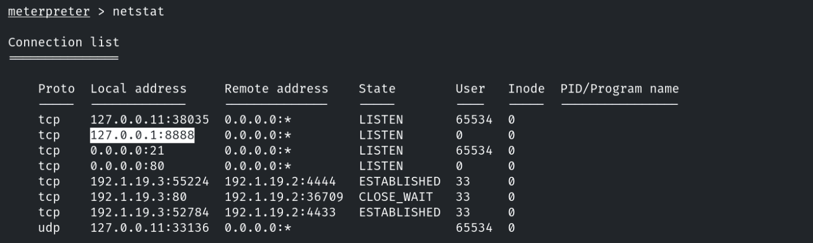

Entre otros, encontramos un servicio disponible y en escucha de conexiones en el puerto `8888` de localhost. Creamos una conexión haciendo uso del comando `nc`.

```console
root@ine# nc 127.0.0.1 8888
```

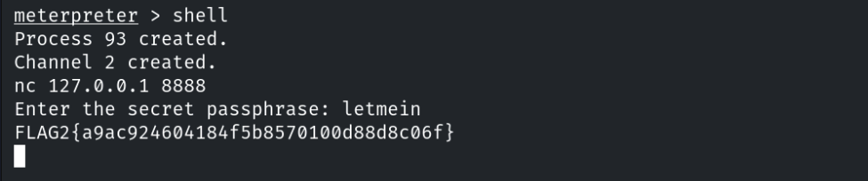

## Flag 3: A misconfigured service running on target2.ine.local may help you gain access to the machine. Can you retrieve the flag from the root directory?

Ya que cambiamos de objetivo, necesitamos volver a escanear los posibles puertos abiertos.

```console
root@ine# nmap -sS -p- -T4 -sC -sV target2.ine.local
```

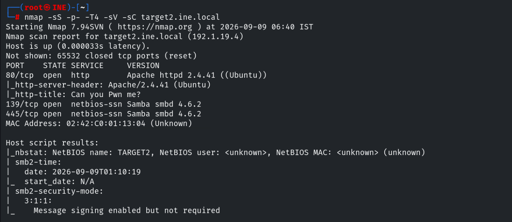

Enumeramos información del servidor SAMBA y encontramos que permite sesiones anonimas.

```console
root@ine# enum4linux -A target2.ine.local
```

Si comprobamos a que recursos tiene acceso este usuario nos encontramos el recurso `site-uploads`, al cual tenemos acceso desde el navegador, permitiendonos ejecutar una webshell.

```console
root@ine# smbclient -U '' -L target2.ine.local
```

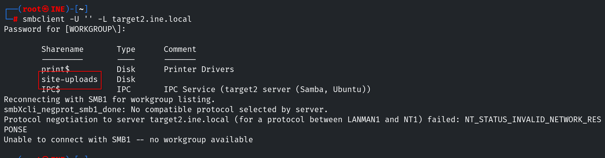
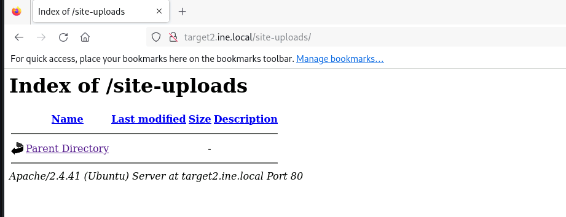

A pesar de las distintas pruebas con varias herramientas no he conseguido enumerar el lenguaje y la versión que usa el servidor Apache, pero teniendo en cuenta que lo más habitual es que use php, he empezado por esta webshell. Está disponible en `/usr/share/webshells/php/php-reverse-shell.php`. Hacemos una copia y la modificamos para añadir nuestra IP y puerto.

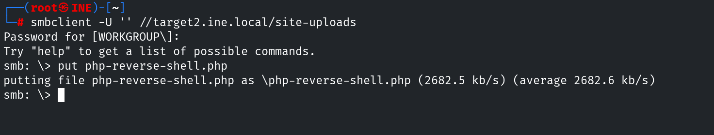

A continuación usamos el usuario anónimo para subir el payload al servidor.

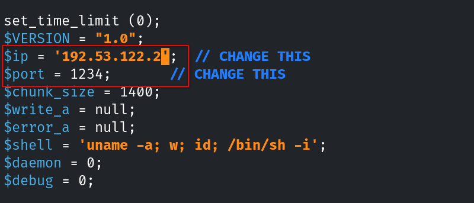

Una vez que hemos creado un listener, podemos ejecutar el payload desde el navegador y obtendremos una shell.

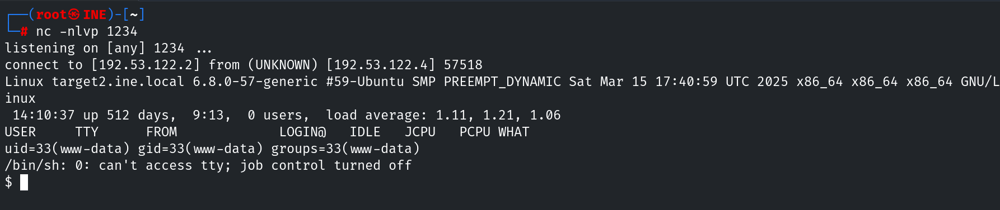

Encontramos la flag en el directorio raiz.

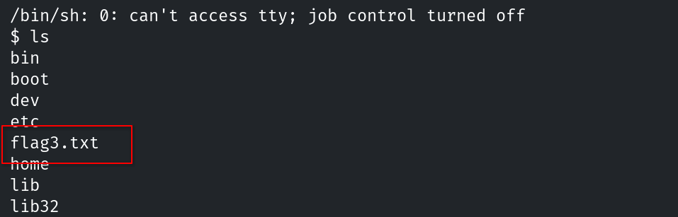

## Flag 4: Can you escalate to root on target2.ine.local and read the flag from the restricted /root directory?
