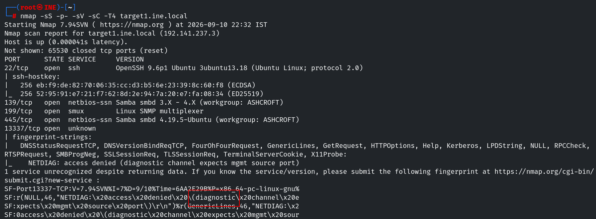
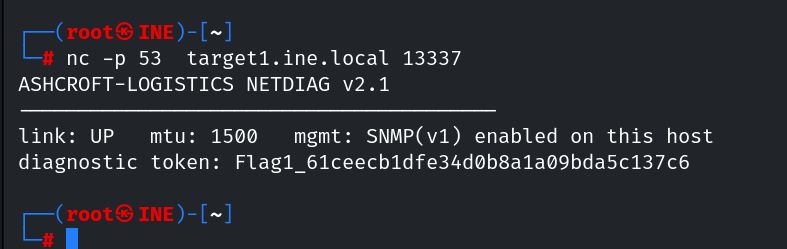
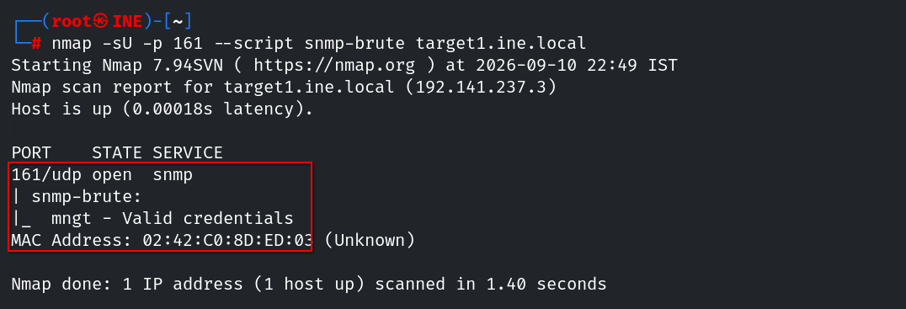
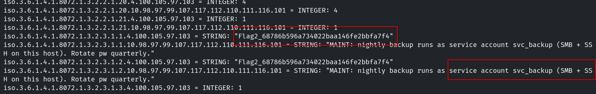
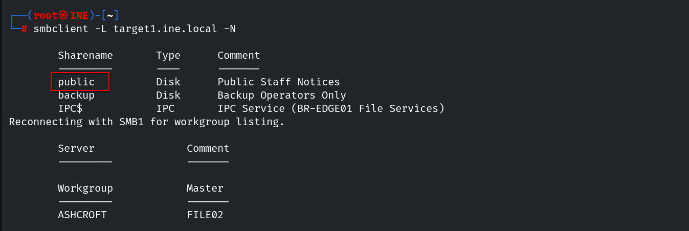
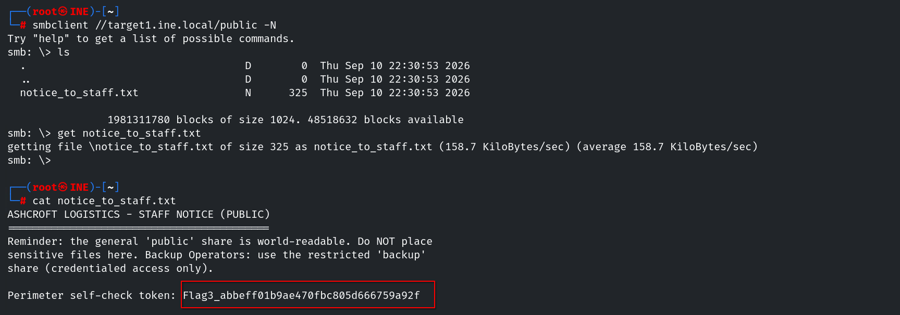

# Network Based Attacks CTF 1

## Task 1: Get the perimeter host to release its diagnostic token

> An ordinary scan of the perimeter host reveals little of use. A diagnostic service is listening, but it only responds to connections that present themselves as low-numbered, well-known traffic (like DNS) rather than a random high-numbered source port, anything else is turned away. Work out what source port the service expects your connection to come from, present your connection accordingly, and read the token it returns.

Para obtener esta flag, primero debemos conseguir acceso al objetivo. El primer paso es enumerar los posibles vectores de ataque.

```console
root@ine# nmap -sS -p- -T4 -sC -sV target.ine.local
```



En este escaneo preliminar encontramos abierto el puerto `13337` y obtenemos información que indica que podría tratarse de un canal de diagnóstico. Usamos `nc` para conectarnos con la intención de obtener más información sobre este servicio y al establecer la conexión nos muestra la primera flag.

```console
root@ine# nc -p 53 target1.ine.local 13337
```



## Task 2: Interrogate the host's management layer

> The perimeter host is monitored. Its management layer will answer questions once you address it correctly - but it will not respond to the obvious defaults. Recover the value it expects, then pull everything the management layer is willing to disclose. One of those disclosures is a token; another is the name of an account you will want later.

Sabemos por esta pista que el host está siendo monitorizado y por el enunciado general del laboratorio que el servicio snmp está activo en el servidor, así que vamos a empezar obteniendo las community strings.

```console
root@ine# nmap -sU -p 161 --script snmp-brute target1.ine.local
```



SNMP organiza la información en una estructura jerárquica llamada **árbol de OID**. Cada dato tiene un identificador numérico que indica su posición dentro del árbol.

Por ejemplo:

```
1 (iso)
└── 3 (org)
    └── 6 (dod)
        └── 1 (internet)
            ├── 2 (mgmt)
            │   └── 1 (mib-2)
            └── 4 (private)
                └── 1 (enterprises)
```

`snmpwalk` recorre los elementos que se encuentran debajo del OID que indiquemos. Si no especificamos ninguno, comienza en una rama predeterminada, por lo que puede no mostrar toda la información disponible.

En este caso, al utilizar `1` como punto de inicio:

```console
root@ine# snmpwalk -v1 -c mngt target1.ine.local 1
```

se recorre el árbol desde `iso`, permitiendo acceder también a ramas donde se encuentran la flag y el usuario.



## Task 3: Enumerate the host's file services without credentials

> The perimeter host shares files. Some of what it shares is available to anyone who asks, with no authentication at all. Enumerate the file services, identify which of them will talk to an unauthenticated client, and read what was left in the open.

La pista nos dice que podemos enumerar recursos compartidos sin necesidad de usar credenciales. Podemos confirmar que el acceso anónimo está permitido usando `enum4linux`, pero en este caso no es necesario y directamente enumeramos los recursos compartidos en el servidor con `smbclient`.

```console
root@ine# smbclient -L target1.ine.local -N
```



Accedemos a `public` y encontramos un archivo que contiene la flag.

```console
root@ine# smbclient //target1.ine.local/public -N
```



## Task 4: Authenticate to the restricted share

> Not everything on the host is public. One share is reserved for a specific account. Between what the management layer told you and what the file services confirm, you know who that account is - now find a way to authenticate as them and read the restricted material. It also tells you where to go next.

se encuentra el usuario con nmap --scirpt snmp-* -p 161 y con enum4linux. contraseña con hydra y valido para obtener el resto de flags en ssh

## Task 5: Reach the internal file server

> There is a second server that you cannot reach from where you are standing. Your foothold on the perimeter host, however, is trusted by it. Use that foothold to route into the internal server, enumerate what it offers, and read the token held on the share that needs no credentials.


## Task 6: Break into the restricted database share

> The internal server keeps its database exports behind a credentialed share. The credentials for it are closer than you think - you passed them on the way in. Authenticate to the restricted share and recover the final token.
