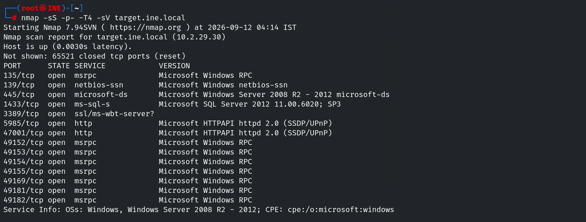
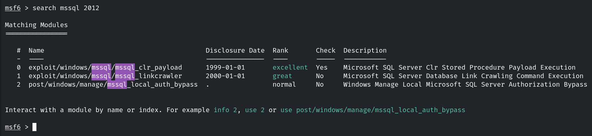
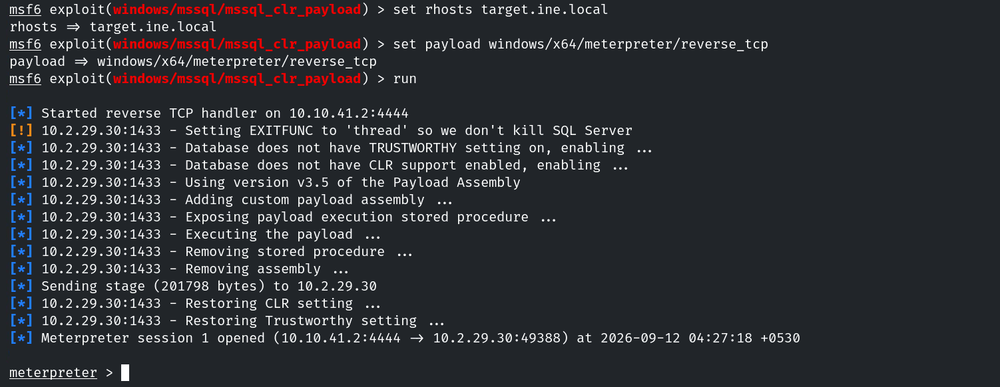
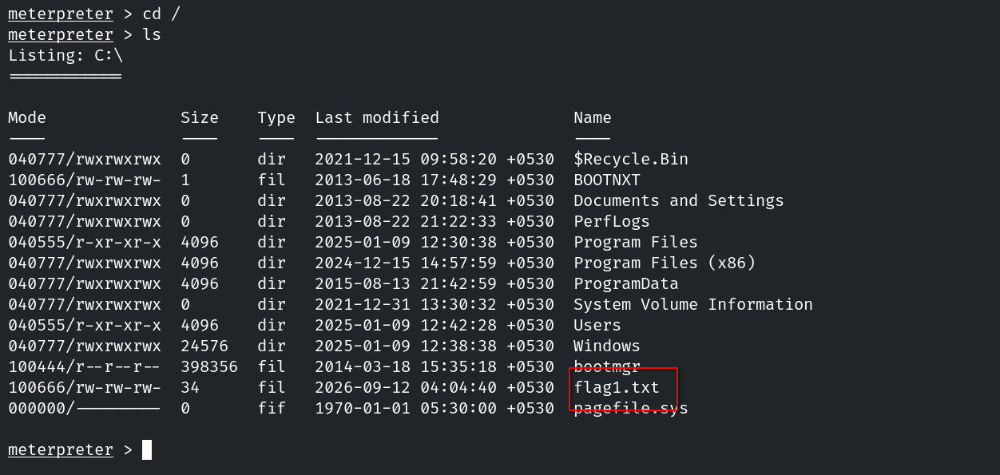
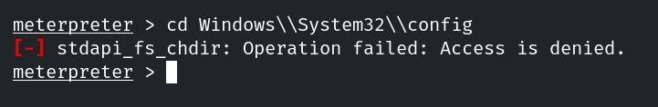
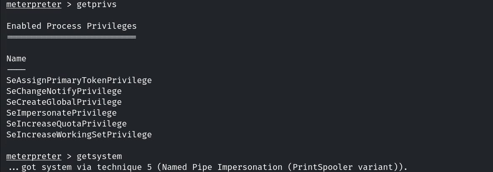
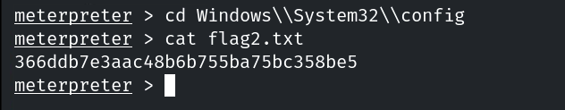

# Host & Network Penetration Testing: The Metasploit Framework CTF 1

## Flag 1: Gain access to the MSSQLSERVER account on the target machine to retrieve the first flag.

Para obtener esta flag, primero debemos conseguir acceso al objetivo. El primer paso es enumerar los posibles vectores de ataque.

```console
root@ine# nmap -sS -p- -T4 -sC -sV target.ine.local
```



Si buscamos en metasplotit la version concreta de mssql, encontramos algunos exploits.

En Metasploit, `mssql_clr_payload` es un payload relacionado con SQL Server CLR Integration: aprovecha que, si CLR está habilitado y la cuenta tiene los permisos necesarios, SQL Server puede cargar y ejecutar ensamblados .NET. Metasploit puede utilizarlo como vía para obtener ejecución de código desde una sesión SQL.



Usamos este módulo para obtener acceso.



Y obtenemos la flag.



## Flag 2: Locate the second flag within the Windows configuration folder.

En esta segunda flag parece que no tenemos acceso al directorio `C:\Windows\System32\config`.



Si enumeramos los permisos que tiene nuestro usuario con el comando `getprivs` vemos que tiene `SeImpersonatePrivilege`, por lo que podemos elevar los privilegios del usuario con `getsysem`.



Ahora que tememos acceso privilegiado, podemos enumerar el directorio de configuración de Windows y mostrar la flag.



## Flag 3: The third flag is also hidden within the system directory. Find it to uncover a hint for accessing the final flag.


## Flag 4: Investigate the Administrator directory to find the fourth flag.


