# Host & Network Penetration Testing: The Metasploit Framework CTF 2

## Flag 1: Enumerate the open port using Metasploit, and inspect the RSYNC banner closely; it might reveal something interesting.

Enumerando los servicios disponibles con nmap encontramos `rsync`. `rsync` es una herramienta para sincronizar y copiar archivos y directorios, normalmente entre dos máquinas o entre dos ubicaciones del mismo equipo. Cuando se habla de rsync como servicio, se refiere a ejecutar rsync en modo daemon, es decir, como un proceso que queda escuchando conexiones de otros equipos. Para copias entre servidores, rsync sobre SSH suele ser la opción más sencilla y segura.

```console
root@ine# nmap -sS -p- -T4 -sC -sV target1.ine.local
```

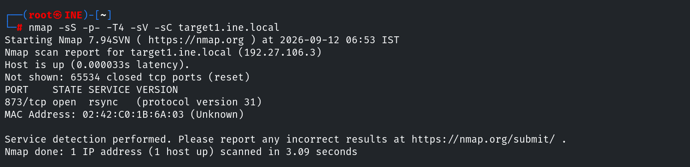

Nos conectamos al servicio para obtener información y nos encontramos la primera flag.

```console
root@ine# rsync rsync://target1.ine.local
```

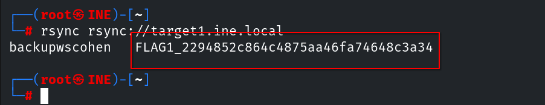

## Flag 2: The files on the RSYNC server hold valuable information. Explore the contents to find the flag.

Durante la enumeración anterior nos encontramos con el recurso `backupwscohen`, así que nos conectamos para seguir enumerando.

```console
root@ine# rsync rsync://target1.ine.local/backupwscohen
```

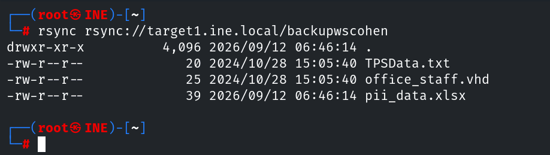

Hacemos una copia de todo el contenido y comprobamos su contenido para encontrar la segunda flag.

```console
root@ine# rsync -av rsync://target1.ine.local/backupwscohen .
```

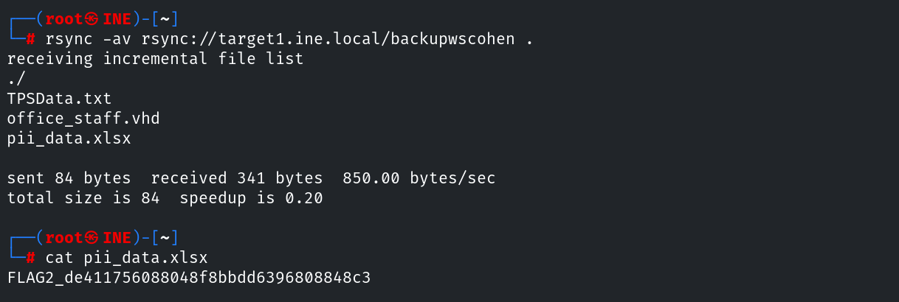

## Flag 3: Try exploiting the webapp to gain a shell using Metasploit on target2.ine.local.

Al cambiar de objetivo es necesario volver a enumerar los puertos y servicios disponibles. En este caso nos encontramos un servidor Apache con los puertos 80 y 443 abiertos, además de la aplicación `Roxy-WI` funcionando en el servidor.

```console
root@ine# nmap -sS -p- -T4 -sC -sV target2.ine.local
```

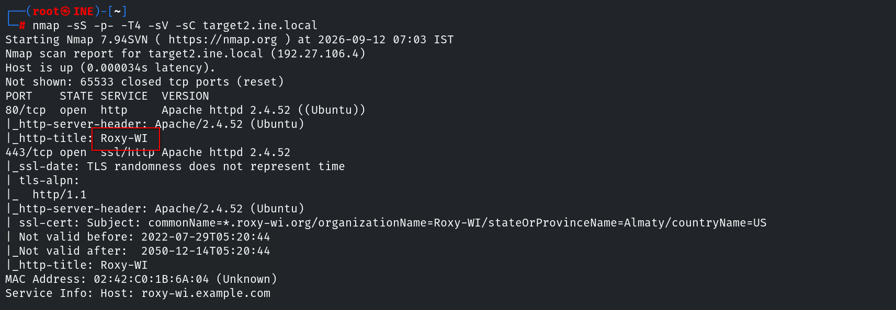

`Roxy-WI` es una herramienta web de administración para servidores de balanceo/proxy, principalmente HAProxy, pero también NGINX, Apache y Keepalived. Su objetivo es permitir gestionar estos servicios desde una interfaz web en lugar de hacerlo todo mediante terminal y editando archivos de configuración manualmente.

Encontrar la versión exacta de la aplicación es poco intuitivo y es más rápido probar directamente el exploit ya que antes de explotar comprueba si el objetivo es vulnerable, pero puede encontrar siguiendo estos pasos:

**1. Usamos el NSE http-enum** que nos muestra algunos direcnorios potencialmente interesantes.

```console
root@ine# nmap -p80,443 --script http-enum target2.ine.local
```

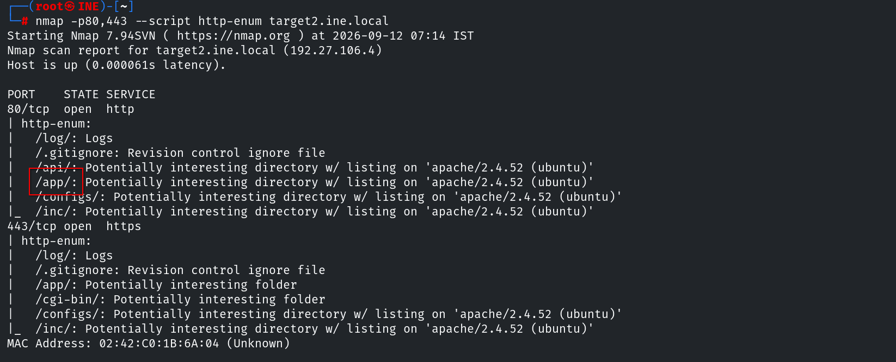

**2. Después de navegar por los directorios,** encontramos una base de datos en `target2.ine.local/app`

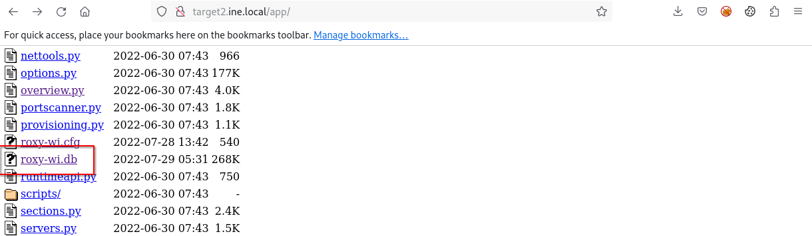

**3. Una vez descargada,** hacemos click sobre ella para abrirla con el programa `DB Browser for SQLite`. Encontramos la versión siguiendo los pasos: *Browse data -> Table: version*

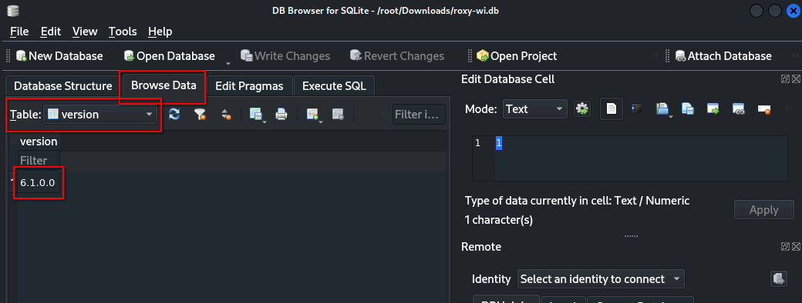

Si buscamos un exploit para `Roxy-WI` en metasploit, nos encontramos con `exploit/linux/http/roxy_wi_exec`, válido para versiones anteriores a la `6.1.1.0`.

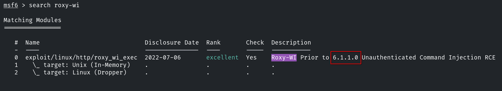

Con este módulo obtenemos una sesión meterpreter y podemos buscar la flag.

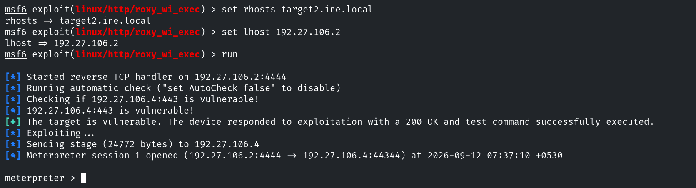

Encontramos la tercera flag en el directorio raíz.

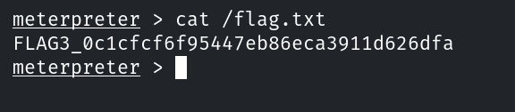

## Flag 4: Automated tasks can sometimes leave clues. Investigate scheduled jobs or running processes to uncover the hidden flag.

En este último reto, al hablar de tareas automatizadas nos estamos refiriendo a cron. Puesto que con el comando `crontab -l` no obtenemos nada, pasamos a enumerar los directorios asociados a cron y nos encontramos un archivo asociado al usuario www-data, usuario con el que obtenemos acceso al sistema. Si mostramos su contenido vemos la última flag.

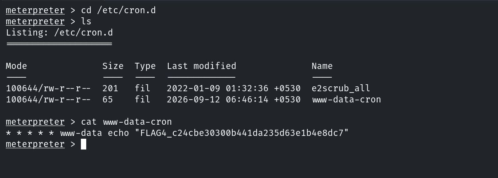
