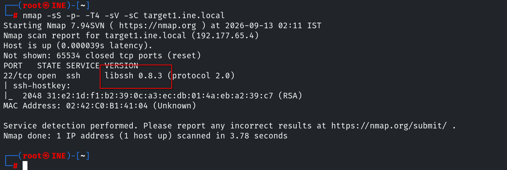
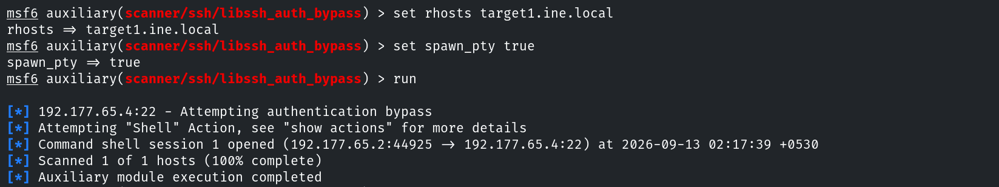
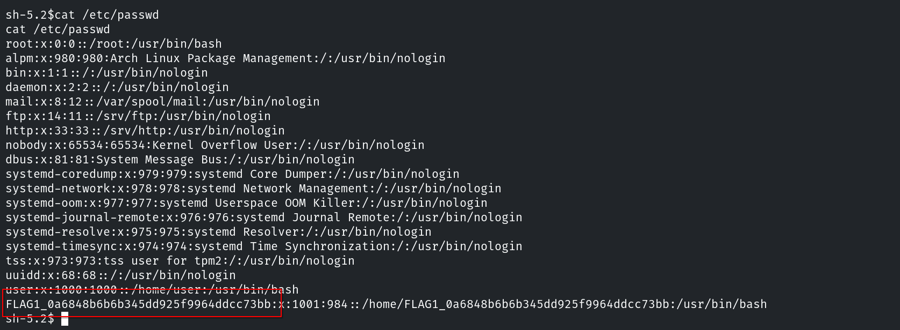
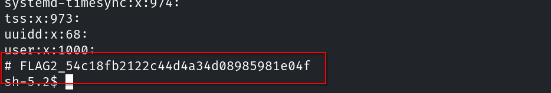
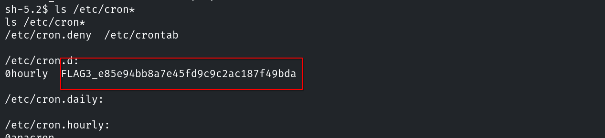
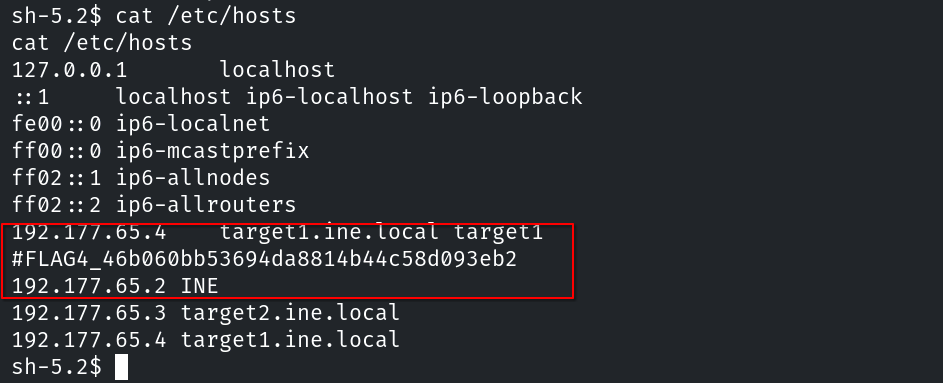
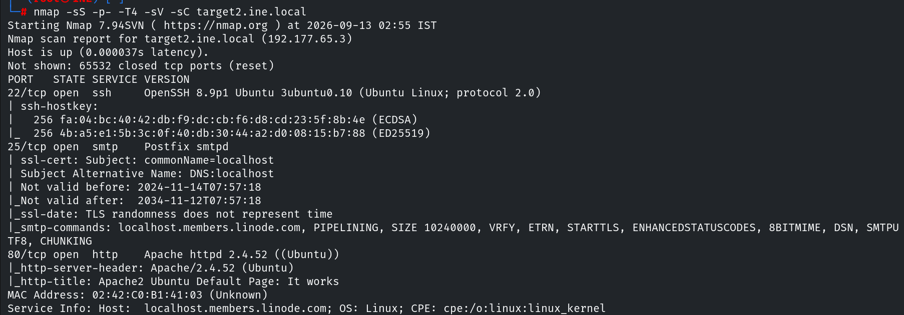
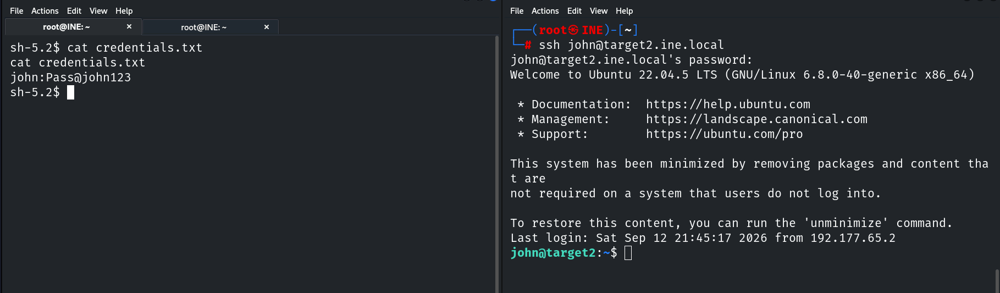
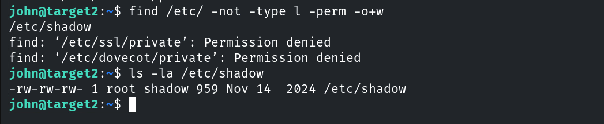

# Host & Network Penetration Testing: Post-Exploitation CTF 1

## Flag 1: The file that stores user account details is worth a closer look. (target1.ine.local)

Para obtener esta flag, primero debemos conseguir acceso al objetivo. El primer paso es enumerar los posibles vectores de ataque.

```console
root@ine# nmap -sS -p- -T4 -sC -sV target.ine.local
```



Nos encontramos abierto el puerto 22 funcionando sobre `libssh 0.8.3`, que como ya sabemos es vulnerable y podemos usar el módulo `auxiliary/scanner/ssh/libssh_auth_bypass` para explotarlo.



Usamos la sesión creada para ver el contenido de `/etc/passwd` y encontrar la primera flag.



## Flag 2: User groups might reveal more than you expect.

Para esta flag solo es necesario mostrar el contenido de `/etc/group`



## Flag 3: Scheduled tasks often have telling names. Investigate the cron jobs to uncover the secret.

Seguimos el mismo proceso que hasta ahora, pero con los distintos archivos y directorios asociados a cron.



## Flag 4: DNS configurations might point you in the right direction. Also, explore the home directories for stored credentials.

Ahora es el turno de `/etc/hosts`



## Flag 5: Use the discovered credentials to gain higher privileges and explore the root's home directory on target2.ine.local.

Al cambiar de objetivo, volvemos a escanear los puertos y los servicios y encontramos ssh sobre el puerto 22.



Durante la fase de post-explotación encontramos unas credenciales en el directorio de uno de los usuarios del sistema anterior. si las usamos podemos acceder mediante ssh al segundo sistema.



Si buscamos archivos con permisos de escritura mal configurados, nos encontramos entre ellos `/etc/shadow`. Esto significa que podemos modificarlo y cambiar la contraseña de usuario root para elevar los privilegios.




