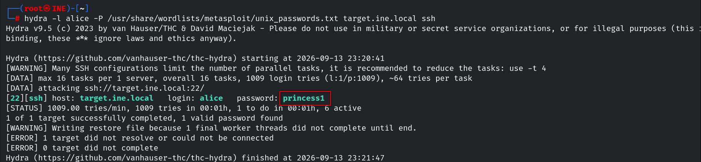
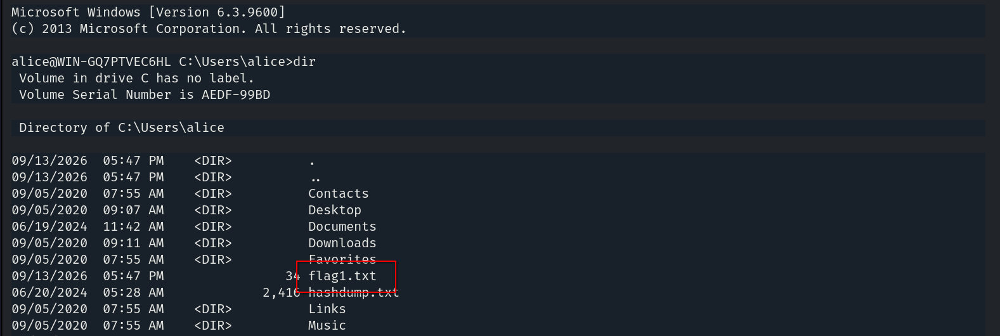
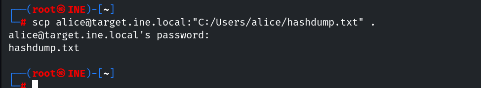
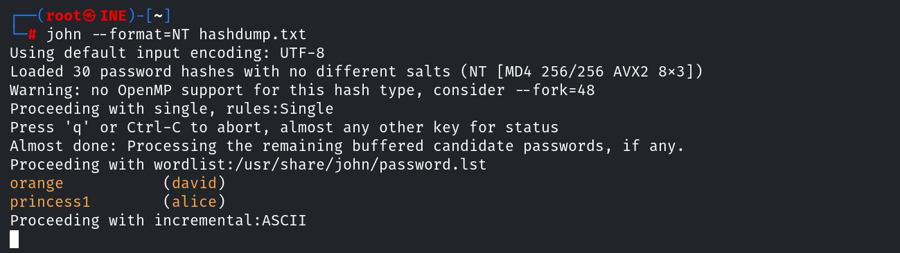

# Host & Network Penetration Testing: Post-Exploitation CTF 2

## Flag 1: An insecure ssh user named alice lurks in the system.

Como ya conocemos un usuario y sabemos que el servicio ssh se encuentra activo, pasamos directamente a tratar de obtener sus credenciales.

```console
root@ine# hydra -l alice -P /usr/share/wordlists/metasploit/unix_passwords.txt target.ine.local ssh
```



Conseguimos acceso al sistema Windows y conseguimos la primera flag en el home del usuario.



## Flag 2: Using the hashdump file discovered in the previous challenge, can you crack the hashes and compromise a user?

Primero copiamos el archivo a la máquina kali.



Usamos `JohntheRipper` para romper el hash y así tratar de encontrar las nuevas credenciales.

```console
usr@hostname:~# john --format=NT hashdump.txt
```



## Flag 3: Can you escalate privileges and read the flag in C://Windows//System32//config directory?


## Flag 4: Looks like the flag present in the Administrator's home denies direct access.


