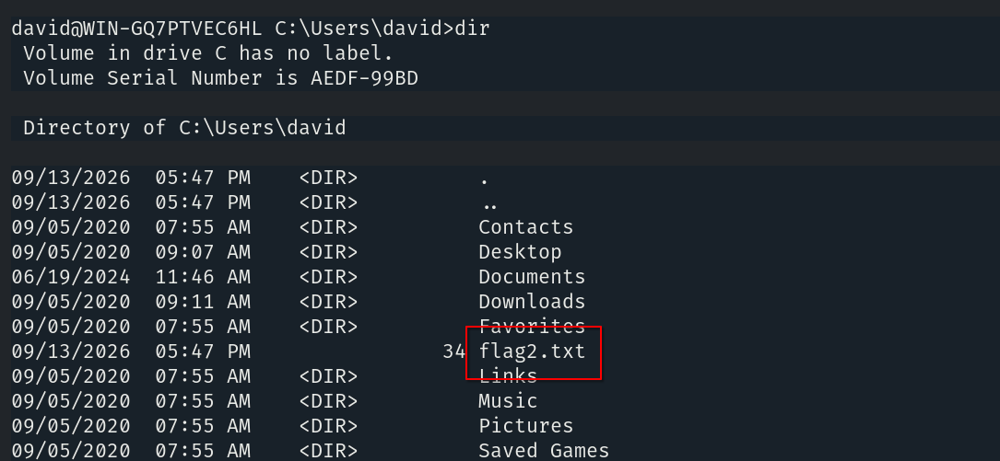
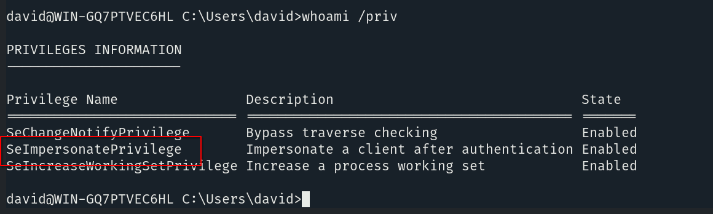
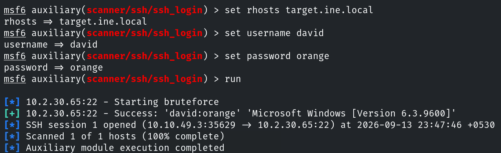
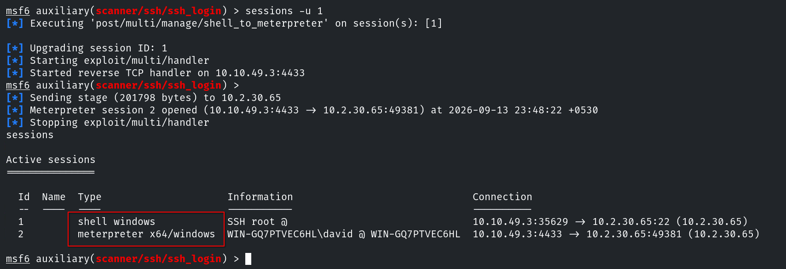
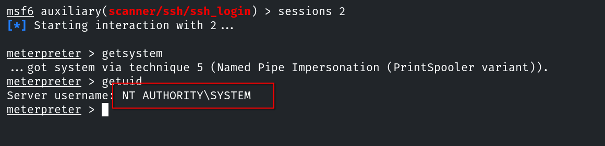
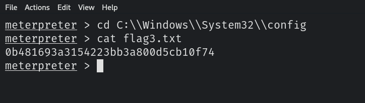

# Host & Network Penetration Testing: Post-Exploitation CTF 2

## Flag 1: An insecure ssh user named alice lurks in the system.

Como ya conocemos un usuario y sabemos que el servicio ssh se encuentra activo, pasamos directamente a tratar de obtener sus credenciales.

```console
root@ine# hydra -l alice -P /usr/share/wordlists/metasploit/unix_passwords.txt target.ine.local ssh
```


Conseguimos acceso al sistema Windows y conseguimos la primera flag en el home del usuario.


## Flag 2: Using the hashdump file discovered in the previous challenge, can you crack the hashes and compromise a user?

Primero copiamos el archivo a la máquina kali.


Usamos `JohntheRipper` para romper el hash y así tratar de encontrar las nuevas credenciales.

```console
usr@hostname:~# john --format=NT hashdump.txt
```


De la misma forma que antes, la flag se encuentra en el directorio home del usuario.



## Flag 3: Can you escalate privileges and read the flag in C://Windows//System32//config directory?

Despues de enumerar información del systema con ambos usuarios, encontramos que `david` dispone del privilegio `SeImpersonatePrivilege`.



Esto nos permite elevar los privilegios usando una sesión meterpreter. Para ello usamos el módulo `ssh_login`.



Este módulo crea una sesión shell igual que si usamos el comando ssh. Para tener una sesión meterpreter usamos `sessions -u 1`.



Ahora sí, podemos elevar los privilegios usando el comando `getsystem` desde la nueva sesión.



Si navegamos al directorio que nos indica la pista y encontraremos la flag.



## Flag 4: Looks like the flag present in the Administrator's home denies direct access.

Si intentamos navegar al directorio que contiene la flag dentro del home del usuario administrador, se nos deniega el acceso. Además, al comprobar los permisos sobre este directorio vemos que se está bloqueando a `NT AUTHORITY\SYSTEM`.

```console
C:> cd C:\Users\Administrator
C:> icalcs flag
```


