# Mr. Robot

Esta máquina virtual tiene tres claves ocultas en diferentes ubicaciones. Tu objetivo es encontrar las tres. Cada clave es progresivamente más difícil de encontrar.

La máquina virtual no es demasiado complicada. No hay ninguna explotación avanzada ni ingeniería inversa. El nivel se considera de principiante a intermedio.

**Máquina:** Mr. Robot (VulnHub)
**SO/Arquitectura:** Linux/x86
**Dificultad:** Principiante
**Técnicas:** Enumeración Web, Fuerza Bruta, Explotación SUID.

Descarga [aquí](https://www.vulnhub.com/entry/mr-robot-1,151/)

## Resolución

### Flag 1: enumeración

Como suele ser habitual, comenzamos con un escaneo de puertos para comprobar que servicios y versiones hay disponibles en esta máquina. En este caso nos encontramos con un servidor apache en el puerto 80 y 443. Si profundizamos un poco más 

```console
root@ine# nmap -sS -p- -T4 -sC -sV 192.168.1.142
```

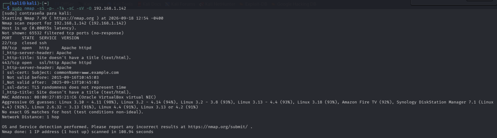

Si profundizamos un poco más en la enumeración, podemos encontrar algunos directorios típicos que nos confirman que nos enfrentamos a una web creada con wordpress.

```console
root@ine# nmap -p80,443 --script http-enum 192.168.1.142
```

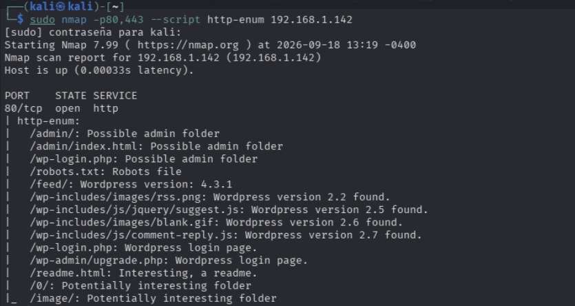

Vemos que el archivo `robots.txt` está disponible. Este documento incluye directorios web que no queremos que indexen los navegadores. Revisamos su contenido y encontramos la primera flag, además de un diccionario con palabras que podremos usar más adelante.

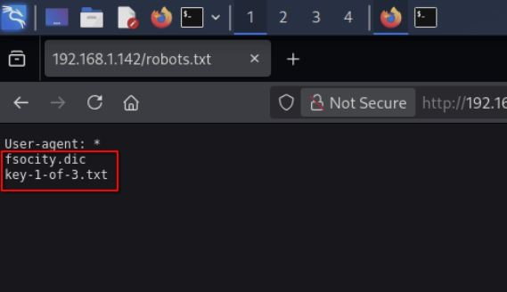

### Flag 2: Explotación wordpress y obtención de usuarios locales

Para obtener acceso a la aplicación wordpress encontramos al menos dos formas. Aquí se explica la que tiene más relación con las técnicas necesarias para la certificación eJPT. Una de las técnicas más comunes en esta certificación es el uso de la fuerza bruta y en este caso podemos usar hydra para tratar de conseguir tanto el usuario como sus credenciales.

El método `http-post-form` de hydra necesita al menos tres parámetros: rura del formulario, datos post (usuario y contraseña) y mensaje de error. Aún no disponemos de un usuario, por lo que probar todas las palabras del diccionario que hemos encontrado antes puede tardar demasiado. La solución a esto pasa por el tercer parámetro. Si hacemos un intento de iniciar sesión para que la aplicación muestre el mensaje de error nos encontramos con *"Invalid username"*. Esto nos ofrece mucha información y la posibilidad de enumerar usuarios.


Para enumerar los usuarios necesitamos los valores de los campos del formulario. Usamos burpsuite y foxyproxy para interceptar un intento de inicio de sesión.

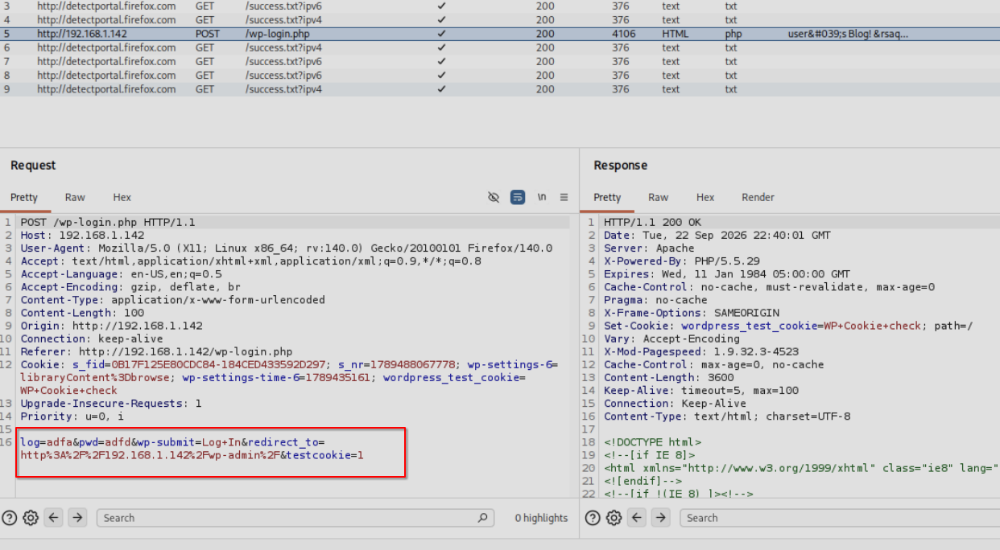

Una vez que conocemos estos parámetros, usamos hydra y la lista obtenida durante la fase de reconocimiento inicial. Hay que tener en cuenta que el diccionario es considerablemente largo y contiene palabras duplicadas, es recomendable eliminarlas.

```console
kali@kali$ sort -u fsocity.dic > fs-list
kali@kali$ hydra -L fs-list -p test 192.168.1.142 http-post-form "/wp-login.php:log=^USER^&pwd=^PASS^:Invalid username"
```

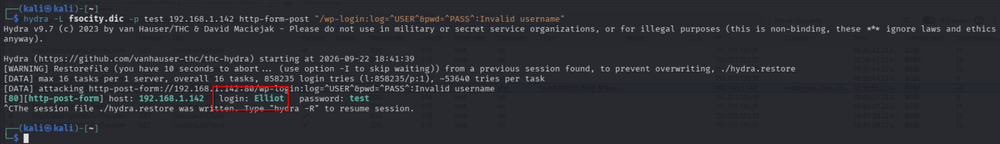

Si ahora intentamos iniciar sesión con el usuario `Elliot`, vemos que el mensaje cambia. Esto se debe a que WordPress, en versiones antiguas, cometía el error de diseño de revelar si el usuario existía cambiando el mensaje de error, lo que permitía la enumeración de usuarios ([**CWE-204**](https://cwe.mitre.org/data/definitions/204.html))

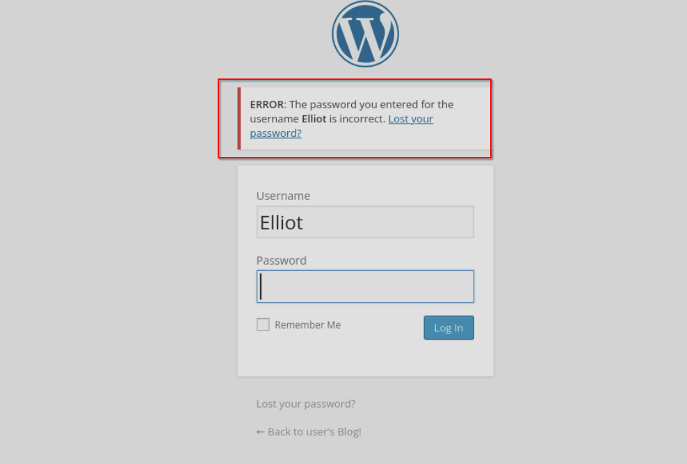

```console
kali@kali$ hydra -l Elliot -P fs-list 192.168.1.142 http-post-form "/wp-login.php:log=^USER^&pwd=^PASS^:The password you entered for de username"
```

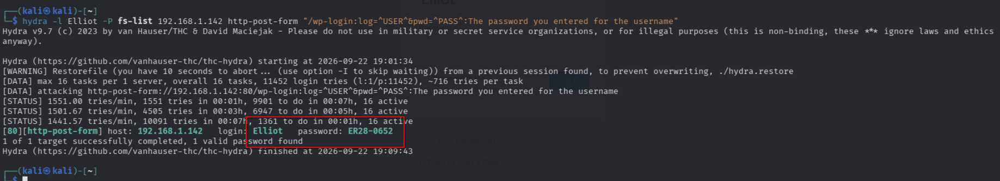

Ahora que tenemos las credenciales y una vez dentro del panel de usuario de wordpress comprobamos que `Elliot` es un usuario administrador y tiene acceso al panel de edición de los temas de apariencia. Esto nos permite modificar el código con la intención de añadir un payload que ejecute una reverse shell. Yo he usado el código de Pentestmonkey disponible [aquí](https://raw.githubusercontent.com/pentestmonkey/php-reverse-shell/master/php-reverse-shell.php) o en `/usr/share/webshells/php/php-reverse-shell.php` dentro de kali. Una vez copiado, modificamos la IP y el puerto de escucha para que se conecte a nuestra máquina kali.

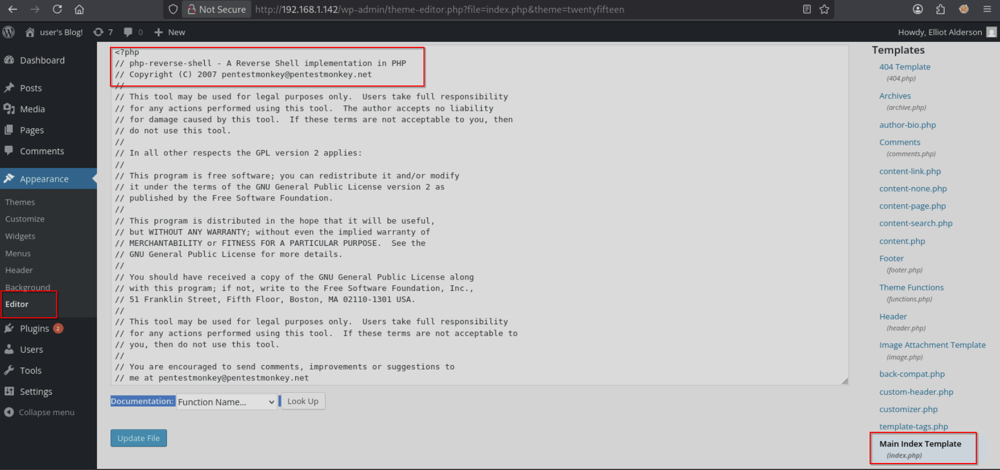

Iniciamos un listener con `nc -nlvp 1234` y nos conectamos a cualquiera de las páginas que cargue el tema para ejecutar la shell, por ejemplo: `http://192.168.1.142/0/`

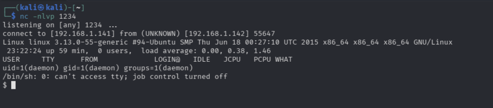

Una vez dentro enumeramos los usuarios y sus directorios y encontramos la segunda flag, además de un archivo llamado `password.raw-md5`. El problema es que solo el usuario robot tiene acceso al archivo que contiene la flag.

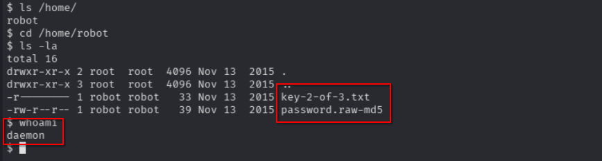

Copiamos el contenido de este fichero a la máquina kali y usamos john para intentar obtenerla en texto plano. Antes de esto podemos usar la herramienta `hash-identifier` para asegurarnos de que realmente sea un hash md5 y ahorrarnos intentos fallidos.

```console
kali@kali$ john --format=Raw-MD5 --wordlist=/usr/share/wordlists/rockyou.txt pass.txt
```

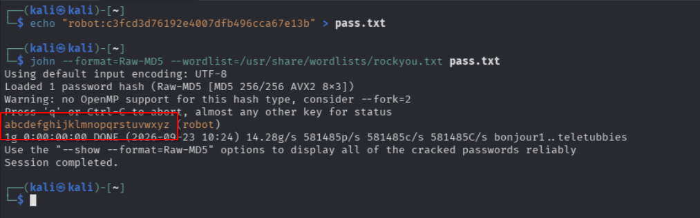

Iniciamos sesión con el usuario `robot` y podremos ver la flag. Para poder usar el comando `su` es necesario que tengamos una shell interactiva. En este caso la conseguimos mediante python.

```console
robot@linux$ python -c "import pty;pty.spawn('/bin/bash')"
```

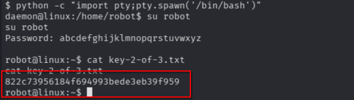

### Flag 3: Escalada de privilegios

El siguiente paso es conseguir acceso privilegiado al sistema. Después de enumerar distintos métodos de escalada de privilegios nos encontramos con que `nmap` tiene los permisos **SUID** activos. Estos pueden permitir que, si el binario inicial (en este caso `nmap`) puede ejecutar otro binario o comando, el segundo herede los permisos root del primero. Si comprobamos la versión de `nmap` nos encontramos con la 3.81. `nmap` tenía un modo interactivo que permitía la ejecucion de comandos hasta su versión 5.21. 

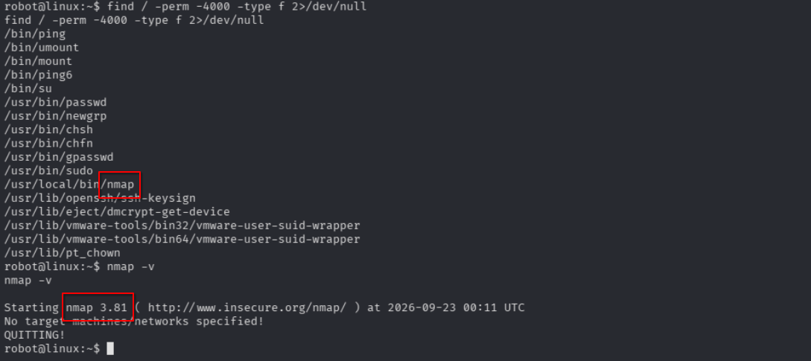

Entramos en el modo interativo de nmap y ejecutamos una shell que permita heredar los permisos, por ejemplo `!sh` o `!/bin/bash`.

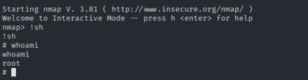

Para terminar, accedemos al home de root y tendremos la última flag.

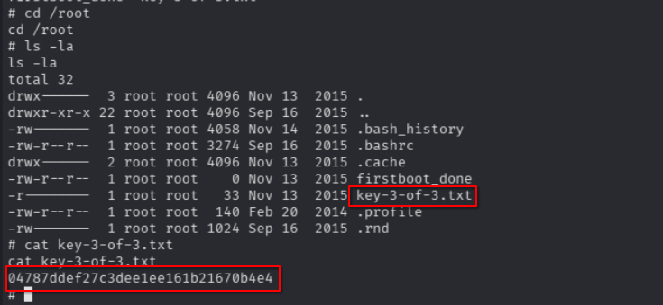

## Mitigación

- Para WordPress: 
	- Instalar plugins como Fail2Ban o Wordfence para bloquear ataques de fuerza bruta
	- Cambiar las configuraciones para que los mensajes de error de inicio de sesión sean genéricos, evitando la enumeración de usuarios.
	- Deshabilitar el editor de archivos en el panel de administración (wp-config.php -> define('DISALLOW_FILE_EDIT', true);) para evitar la inyección de la reverse shell si el admin es comprometido.
- Para el Sistema Operativo:
	- Eliminar el permiso SUID de binarios que no lo necesiten.
	- En caso de requerir escaneos privilegiados, utilizar Capabilities de Linux en lugar de SUID.
	- Acualizar la versión de Nmap a una posterior a la 5.21 donde se eliminó el modo interactivo de forma nativa.
